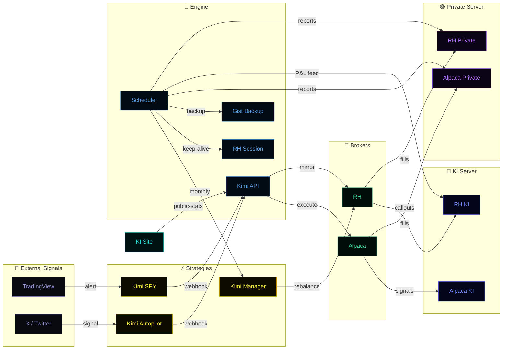

# Kimi Auto Trade

A production-ready Python / FastAPI service that runs **three parallel trading strategies** on Alpaca and Robinhood simultaneously. Tracks investors, posts trade signals and P&L reports to Discord, and handles queued/after-hours orders automatically.

Deployed on [Render](https://render.com) with a persistent disk at `/data/`.

**Public landing page:** [kimiinvest.com](https://kimiinvest.com) — live SPY performance stats, cumulative return chart, track record chart, and Whop signup. Powered by `GET /public-stats`, `GET /public-claude-performance`, and `GET /public-visit-count` on this server.

---

## System Map

**Interactive version:** [kimiinvest.com/system-map.html](https://kimiinvest.com/system-map.html) — click any node for full details, inputs/outputs, and technical references.



**Node key:**

| Name | Layer | What it does |
|---|---|---|
| **Kimi SPY** | Strategy | TradingView-triggered SPY DCA — Alpaca primary, RH mirror |
| **Kimi Autopilot** | Strategy | Manual X/Twitter signals forwarded to RH |
| **Kimi Manager** | Strategy | Autonomous monthly Claude Opus rebalancer on RH |
| **Kimi API** | Engine | FastAPI on Render — webhook router, slash commands, public endpoints |
| **Scheduler** | Engine | APScheduler cron — all P&L reports, rebalance, keep-alive, backup |
| **RH Session** | Engine | Robinhood auth + randomised keep-alive (1–5 AM ET, every 1–2 days) |
| **Gist Backup** | Engine | Nightly /data/ push to private GitHub Gist |
| **Alpaca** | Broker | Kimi SPY execution only |
| **RH** | Broker | All three strategies |
| **Alpaca KI** | KI Server | SPY signals + Trades P&L summary → subscribers |
| **Alpaca Private** | Private Server | Fills + full P&L suite + tax → owner only |
| **RH KI** | KI Server | Manager/Autopilot callouts → subscribers |
| **RH Private** | Private Server | Everything: fills, P&L, snapshot, Investor Tracker, session alerts, tax |
| **KI Site** | Site | kimiinvest.com — public dashboard + Whop gateway |

---

## Architecture Detail

```
╔══════════════════════════════════════════════════════════════════════════════════╗
║                        FastAPI Server  (Render)                                  ║
║                                                                                  ║
║  ┌──────────────────────┐  ┌─────────────────────┐  ┌──────────────────────┐   ║
║  │   KIMI STRATEGY      │  │  KIMI AUTOPILOT     │  │   KIMI MANAGER       │   ║
║  │                      │  │  PORTFOLIO          │  │   (Autonomous)       │   ║
║  │  SPY DCA overlay     │  │                     │  │                      │   ║
║  │  • base_entry        │  │  Manual picks from  │  │  Calls Anthropic API │   ║
║  │  • add_leverage      │  │  @theaiportfolios   │  │  (claude-opus-4-8)   │   ║
║  │  • remove_leverage   │  │  Twitter signals    │  │                      │   ║
║  │  • stop_loss         │  │                     │  │  Prompt includes:    │   ║
║  │                      │  │  5% buying power    │  │  • Fundamentals      │   ║
║  │  Alpaca (primary)    │  │  per trade on RH    │  │  • Macro (VIX/10Y/   │   ║
║  │  RH (mirror)         │  │                     │  │    CPI)              │   ║
║  │                      │  │  Tracked in         │  │  • Earnings dates    │   ║
║  │  SPY ONLY — never    │  │  claude_portfolio   │  │  • Rebalance history │   ║
║  │  touched by Kimi     │  │  .json              │  │                      │   ║
║  └──────────┬───────────┘  └─────────┬───────────┘  └──────────┬───────────┘   ║
║             │                        │    yfinance ─────────────┤               ║
║             │                        │    FRED API  ────────────┤               ║
║             │                        │    (macro + earnings)    │               ║
║             └────────────────────────┴──────────────────────────┘               ║
║                                      │                                          ║
║                         ┌────────────▼────────────┐                            ║
║                         │    Robinhood Client      │                            ║
║                         │    (robin_stocks)        │                            ║
║                         │    fractional shares     │                            ║
║                         └────────────┬────────────┘                            ║
╚══════════════════════════════════════╪═════════════════════════════════════════╝
                                       │
              ┌────────────────────────┴────────────────────────┐
              ▼                                                  ▼
   ┌──────────────────────┐                         ┌──────────────────────┐
   │     ALPACA           │                         │    ROBINHOOD         │
   │  Kimi strategy only  │                         │  All 3 strategies    │
   │  (SPY via DCA)       │                         │  • Kimi SPY mirror   │
   │                      │                         │  • Kimi Autopilot    │
   │  alpaca-py SDK       │                         │  • Kimi Manager      │
   └──────────────────────┘                         └──────────────────────┘

════════════════════════════════════════════════════════════════
  PUBLIC WEBSITE  (GitHub Pages → Moses-log/kimi-invest-site)
════════════════════════════════════════════════════════════════

  Kimi Invest ──► GET /public-stats             ← SPY FIFO stats + spot counter
  kimiinvest.com   GET /public-claude-performance ← Kimi Manager portfolio vs SPY chart
                   GET /public-claude-callouts   ← Kimi Manager trade callouts
                   GET /public-visit-count       ← atomic visit counter (increments on fetch)
                   (all: no auth, CORS open, stats endpoint 1-hour in-memory cache)

  Whop.com    ──► POST /whop-webhook           ← membership.went_valid  → decrement spots
                                                  membership.went_invalid → increment spots
                                                  writes /data/early_access.json (0–15)

════════════════════════════════════════════════════════════════
  SCHEDULED JOBS  (APScheduler inside the FastAPI process)
════════════════════════════════════════════════════════════════

  Mon–Thu 4:00 PM ET ──► Alpaca daily P&L  +  RH daily P&L  +  Investor breakdown
                         + RH equity snapshot (for historical P&L comparisons)
  Fri     4:00 PM ET ──► Above  +  weekly P&L charts  +  Portfolio Pie Chart
  1st of month 9:35 AM ET ──► Kimi autonomous portfolio rebalance
  Daily midnight ET ────► Gist backup — all critical /data/ files pushed to private GitHub Gist
  Daily 1–5 AM ET ───► RH session keep-alive (randomized 1–2 day interval, random minute in window)
  Jan/Apr/Jul/Oct 1 ───► Quarterly Alpaca + RH tax summaries
  9:31 AM ET next open ► Queued Kimi sell fill confirmation (when after-hours)

════════════════════════════════════════════════════════════════
  DISCORD CHANNELS
════════════════════════════════════════════════════════════════

  DISCORD_TRADES_WEBHOOK_URL        ← Alpaca trade fills (Kimi)
  RH_DISCORD_WEBHOOK_URL            ← Robinhood trade fills (Kimi mirror)
  CLAUDE_PORTFOLIO_WEBHOOK_URL      ← Kimi Autopilot manual signal trades + fill confirmations
  CLAUDE_MANAGER_WEBHOOK_URL        ← Kimi autonomous analysis, rebalance trades, benchmark
  PORTFOLIO_SNAPSHOT_WEBHOOK_URL    ← Friday RH pie chart + valuation rating
  RH_PNL_WEBHOOK_URL                ← Robinhood P&L reports (daily/weekly/monthly)
  RH_SESSION_WEBHOOK_URL            ← RH session alerts (expiry, keep-alive)
  DISCORD_WEBHOOK_URL               ← Main: Alpaca P&L, errors, fallback
  DISCORD_INVESTORS_WEBHOOK_URL     ← Investor equity breakdown
  ALPACA_TAX_WEBHOOK_URL            ← Quarterly Alpaca tax summaries
  RH_TAX_WEBHOOK_URL                ← Quarterly RH tax summaries
  SIGNAL_SUBSCRIBERS_WEBHOOK_URL    ← Paid Kimi Invest Discord: Kimi BUY/SELL signals + WIN/LOSS
  CLAUDE_SUBSCRIBERS_WEBHOOK_URL    ← Paid Kimi Invest Discord: Kimi BUY/SELL/TRIM/DOUBLE_DOWN signals

════════════════════════════════════════════════════════════════
  PERSISTENT DISK  (/data on Render)
════════════════════════════════════════════════════════════════

  robinhood.pickle          ← RH session token (auto-refreshed every 1–2 days, 1–5 AM ET)
  investors.json            ← Investor deposit history
  trade_record.json         ← Alpaca win/loss record
  rh_trade_record.json      ← RH win/loss record (all strategies)
  leverage_entry.json       ← ADD_LEVERAGE fill prices (accurate DCA P&L)
  pending_orders.json       ← Queued orders (Alpaca + Kimi sells) — survive restarts
  pending_withdrawals.json  ← Withdrawals awaiting their approval delay window
  withdrawal_audit.json     ← Append-only log of executed / canceled / failed withdrawals
  idempotency.json          ← Seen alert IDs (duplicate suppression, 5 min TTL)
  claude_portfolio.json     ← Kimi Autopilot + Manager positions + W-L record
  claude_rebalance_log.json ← Monthly rebalance audit log (36 entries max)
  rh_positions_cache.json   ← Last-known RH positions (pie chart fallback)
  early_access.json         ← Kimi Invest early-access spot counter (0–15, Whop-driven)
```

---

## The Three Strategies

### 1 — Kimi Strategy (SPY DCA)

Dollar-cost-averaging overlay triggered by TradingView Pine Script alerts. Executes on both Alpaca (primary) and Robinhood (mirror).

- **Base Entry** — intentionally ignored by the bot; you place the initial position manually on Alpaca.
- **Add Leverage** — DCA buy sized as `leverage_factor × Alpaca buying power`.
- **Remove Leverage** — closes only the DCA portion, leaving the base position intact.
- **Stop Loss** — closes the entire position on both brokers.

> SPY is managed exclusively by the Kimi strategy. Neither Kimi system will ever touch SPY.

---

### 2 — Kimi Autopilot Portfolio

Manual endpoint for trading signals from [@theaiportfolios](https://x.com/theaiportfolios) on Twitter/X. You read the tweet, confirm it's a live signal, and fire the endpoint. The bot executes on Robinhood using `CLAUDE_LEVERAGE_FACTOR` (default 5%) of buying power.

```bash
curl -X POST https://your-render-url/claude-signal \
  -H "Content-Type: application/json" \
  -d '{"secret":"...","ticker":"FICO","action":"BUY","tweet_url":"https://x.com/..."}'
```

Positions tracked in `/data/claude_portfolio.json` with entry price, qty, W-L record, and tweet URL. When a sell is placed after market hours, the bot queues a fill confirmation job at 9:31 AM ET the next trading day to resolve the actual fill price and P&L.

---

### 3 — Kimi Portfolio Manager (Autonomous)

On the **1st of each month at 9:35 AM ET**, the system:

1. Fetches all RH positions + buying power
2. Enriches each holding with **yfinance fundamentals** (Forward P/E, PEG, EV/EBITDA, ROE, margins, short interest, earnings date) and **yfinance-computed technical indicators** (200-day MA position, RSI(14), calendar-QTD performance, RS vs SPY) — fundamentals and technicals fetched in parallel for all tickers. Any holding missing a **critical metric** (RSI, 200-day MA, QTD performance, Forward P/E, or revenue growth) is tagged inline with a `_data_gaps` marker so Claude knows it's judging that name on partial data — the gaps are also surfaced to Discord (silent when every holding is complete)
3. Fetches **macro context** in parallel: VIX, 10Y Treasury yield, and CPI YoY (via FRED API if configured)
4. Loads **last 3 rebalance log entries** (date, portfolio value, SPY price, trade counts) + the **full 5-section research from the most recent entry** so Claude can track thesis evolution month-over-month
5. Calls **claude-opus-4-8** via the Anthropic API using an **agentic loop** (up to 80 turns, 16,000 token responses). Claude has access to **live internet search** (`web_search_20250305`, up to 30 searches per rebalance) — used to verify news, earnings surprises, analyst estimate revisions, SEC filings, short interest updates, and macro context. Each search is handled server-side by Anthropic; results are embedded in the response and cited inline.
6. The system scores every holding 0–100 across Quality / Growth / Momentum / Valuation / Competitive Advantage — using macro conditions and upcoming earnings dates to inform timing
7. The system proposes an optimal portfolio using five trade actions:
   - **BUY** — open or add to a position (delta-buy: only invests the additional dollars needed to reach target weight)
   - **DOUBLE_DOWN** — explicitly add to an existing position with elevated conviction (same delta-buy execution, distinct Discord signal)
   - **SELL** — close an entire position
   - **TRIM** — reduce a position to a lower target weight without closing it (blocked if qty < 1 share — Robinhood cannot partially sell fractional positions)
   - **HOLD** — no trade, maintain target weight
8. **Risk guardrails run before execution** (`app/risk_guardrails.py`): any BUY/DOUBLE_DOWN/TRIM over 25% is hard-clamped down to 25% in place, and a `⚠️ RISK GUARDRAIL` Discord alert fires if any single sector's post-trade weight would exceed 50% (alert-only — no auto-scaling). Enforces the stated policy in code rather than trusting the prompt alone
9. Sells execute first; buy budget = cash + expected sell proceeds (handles after-hours queued-sell lag)
9. After-hours sells are saved as pending orders and resolved at market open with actual fill price and P&L
10. Full analysis + each trade posted to Discord; full audit log saved to `/data/claude_rebalance_log.json`
11. **Benchmark comparison** posted at completion (and on no-change months): portfolio % vs SPY % month-over-month and since inception
12. **Decision Review** card posted monthly (`📅 KIMI DECISION REVIEW`) — a **monitoring-only** scorecard for you: every executed trade from the last 6 months (up to 20) scored by the stock's return **vs SPY since the decision** (good/bad/neutral by action) plus the most recent decisions. Derived live from the decision logs + yfinance; **deliberately not fed into Claude's prompt** — it's an observability tool for the operator, so the track record never biases Kimi's decisions toward recency

Can also be triggered on-demand via `/rebalance` Discord slash command or `POST /run-rebalance`.

#### Kimi Portfolio Manager Investment Strategy

The strategy is defined entirely in the system prompt at `app/claude_manager.py` (`_SYSTEM_PROMPT`).

**Core Philosophy:** The stock market rewards companies that solve the world's biggest future problems. Do not simply buy cheap or large companies — identify the businesses *creating* the future. Prioritize innovation, technological disruption, and long-term economic transformation while maintaining strict standards for profitability, valuation, and execution.

**Portfolio Constraints:**
- 5–10 stocks. No ETFs, options, leverage, or short positions. U.S.-listed only, market cap above $2 billion.
- Cash below 10% unless market conditions are exceptionally unfavorable.
- Position sizes up to 25%. No single sector above 50%. **Both are enforced in code** (`app/risk_guardrails.py`) — a position over 25% is hard-clamped before execution; a sector over 50% raises a Discord alert — not just requested in the prompt.
- SPY is permanently excluded — managed by the Kimi DCA strategy.

**Scoring Framework — every stock scored 0–100:**

| Dimension | Weight | What it measures |
|---|---|---|
| Growth | 25% | Revenue growth, EPS growth, FCF growth, TAM expansion, market share |
| Future Dominance Potential | 25% | Exposure to future megatrends, technological leadership, innovation velocity, R&D, patent portfolio, category leadership potential |
| Quality | 20% | ROIC, ROE, gross/operating margin trends, balance sheet, debt, FCF consistency |
| Momentum | 15% | Relative strength vs S&P 500, institutional accumulation, 200-day MA position |
| Valuation | 15% | Forward P/E, PEG, EV/EBITDA, FCF yield, growth-adjusted valuation |

**Future Dominance Themes (evolve with the world):**
AI & infrastructure · Robotics & automation · Space economy · Energy transformation (nuclear, SMRs, storage) · Biotechnology · Digital infrastructure (cloud, cybersecurity, semis) · Defense technology

**Mega-Winner Rule:** Actively search for potential 10x opportunities. A company does not need to be profitable today if revenue growth exceeds 25% annually, gross margins are strong, the TAM is massive, the path to profitability is credible, and it leads a future-dominant industry.

**Bubble Protection:** Never buy solely because something is trending. Require real revenue, improving fundamentals, strong balance sheet, evidence of execution, and sustainable competitive advantages.

**Macro and Timing Rules (injected live into the prompt):**
- **Earnings avoidance**: Avoid initiating or significantly increasing positions within 3 days of earnings unless conviction is very high.
- **Macro calibration**: VIX, 10-year Treasury yield, and CPI YoY are provided. High VIX → defensiveness. Rising yields → pressure on growth multiples.

**Self-awareness (last 3 months of history injected into the prompt):**
- The system sees its own prior analyses, proposed trades, and portfolio performance vs SPY each month — prevents momentum-chasing and enables course correction.

#### Research Framework

Before taking or sizing any position, the system runs a structured 5-section research process defined in `app/claude_manager.py` (`_SYSTEM_PROMPT`) and documented in `docs/AI_Prompt_Guide.pdf`.

| Section | What it covers |
|---|---|
| **1 — Foundation** | Business model, moat, top 3 competitors, unique technological advantage; top 3 upcoming catalysts (Critical / High / Strategic); asymmetry check (valuation floor vs. growth ceiling) |
| **2 — Valuation Rigor** | Rule of 40 (revenue growth % + EBITDA margin %); Value/Growth Score (P/S TTM ÷ YoY revenue growth %); forward P/S vs. TTM P/S (guidance credibility check); 3-year historical P/S range; insider ownership; SBC as % of revenue |
| **3 — Mandatory Bear Case** | Customer concentration (flag if single customer >30% revenue); dilution risk (ATM programs or secondaries in last 24 months); last earnings miss (reason + stock reaction); 10-K specific risks (no boilerplate); bull case critique |
| **4 — Technical Overlay** | **4.1 Key Price Levels** — 52-week high/low, recent support/resistance; **4.2 Moving Averages** — 200-day MA position + slope, 50/200-day golden/death cross; **4.3 Relative Strength** — RS vs SPY calendar-QTD; **4.4 Short Interest** — float %, days to cover, rising/falling trend; **4.5 Sentiment & Volatility** — IV rank, put/call ratio, fear/greed context |
| **5 — Verdict** | Three-point bull case, three-point bear case, net view, conviction (High / Medium / Low), and what would change the thesis |

**Bear case rule:** Any position sized above 10% must have a fully resolved bear case documented in Section 3. If the bear case is unresolved, the position is capped at ≤7% or avoided entirely.

The reference guide is saved at `docs/AI_Prompt_Guide.pdf`.

---

### 4 — Portfolio Snapshot (Fridays + on-demand)

Every Friday at 4:00 PM ET (and via `/portfolio` slash command), the system:

1. Fetches all RH positions + buying power (with fallback to `/data/rh_positions_cache.json` if API is unavailable)
2. Generates a **cyberpunk-style donut chart** showing each position as a neon wedge + cash
3. Fetches yfinance valuation data for every stock in parallel
4. Rates the portfolio on:
   - **Current Valuation** — weighted average Forward P/E vs S&P 500 benchmark (~21x) → Undervalued / Fair Value / Moderately Rich / Expensive
   - **Potential Upside** — weighted average analyst price target vs current price → Strong / Good / Moderate / Limited
5. Posts chart + ratings to `PORTFOLIO_SNAPSHOT_WEBHOOK_URL`

### 5 — Kimi Inspection (Weekly Holdings Check)

On the **first trading day of each week** at **9:35 AM ET** — skipped on any week that coincides with the monthly rebalance — the system runs a lighter, holdings-only check-in between Kimi Portfolio Manager's monthly rebalances:

1. Fetches current RH positions only — **no new candidate screening**. Each holding gets the same critical-metric **data-gap** check as the monthly rebalance (missing metrics tagged inline for Claude + a standalone Discord alert when any gap exists)
2. Loads each holding's **Living Thesis** — the last monthly rebalance's full 5-section research *anchor*, plus any dated Inspection updates layered on since (see [Living Thesis](#living-thesis--the-shared-memory-between-rebalance-and-inspection) below)
3. Calls **claude-opus-4-8** via a lighter agentic loop (up to 30 turns, 8,000-token responses, up to **15 live searches** — about half the monthly rebalance's budget) asking only: has anything material happened to this holding in the last 7 days?
4. Defaults to **HOLD** unless there's a specific, nameable trigger — earnings surprise, guidance change, major company-specific news, a macro shock tied to the name, or a meaningful technical breakdown. Routine price noise is not a trigger.
5. Can act immediately with three trade actions — **SELL** (close the position), **TRIM** (reduce to a lower target weight, same 1-share-minimum rule as the monthly rebalance), or **DOUBLE_DOWN** (add to an existing position with elevated conviction)
6. **Never opens a new position.** BUY is disallowed in the prompt *and* rejected in code — a response containing a BUY anywhere has its entire trade block discarded, nothing executes
7. **Same risk guardrails as the monthly rebalance** (`app/risk_guardrails.py`): a DOUBLE_DOWN/TRIM over 25% is hard-clamped to 25% before execution, and a `⚠️ RISK GUARDRAIL` alert fires if a sector would exceed 50% post-trade
8. Posts full analysis + every trade to Discord (`CLAUDE_MANAGER_WEBHOOK_URL`); posts an actioned-holdings-only summary to the paid subscriber channel (`CLAUDE_SUBSCRIBERS_WEBHOOK_URL`); realized SELL/TRIM P&L is recorded to the same win/loss ledger the monthly rebalance uses
9. Audit log saved to `/data/claude_inspection_log.json` (separate file from the monthly rebalance's log). The next monthly rebalance reads recent Inspection activity as part of its own history context, so it builds on what Inspection already decided instead of re-deriving a thesis

Can also be triggered on-demand via the `/inspection` Discord slash command.

---

### Living Thesis — the shared memory between rebalance and Inspection

Kimi Portfolio Manager (monthly) and Kimi Inspection (weekly) reason over the **same evolving thesis** for each holding, so the two loops build on one another instead of each starting cold. That shared memory is the **Living Thesis**, assembled per ticker in `_build_prior_thesis_map` (`app/claude_inspection.py`).

**The anchor.** Every monthly rebalance writes a durable, per-ticker *anchor thesis* — the full 5-section research (Foundation, Valuation/Rule of 40, Bear Case, Technicals, Verdict) — to `/data/claude_rebalance_log.json`. This is the "why we own this," and it stands until the next rebalance rewrites it.

**The deltas.** Each weekly Inspection that *acts* on a holding (SELL / TRIM / DOUBLE_DOWN) records a one-line, dated reasoning note to `/data/claude_inspection_log.json`. Those notes are layered *beneath* the anchor as an `Updates since last rebalance:` log — they **never replace** it. A HOLD records no note, so a quietly-held stock keeps its full anchor untouched.

**What Inspection sees each week.** For every current holding, the Living Thesis is reconstructed as the most recent rebalance anchor followed by the most recent Inspection updates (oldest → newest), capped at the last **4 per ticker** (`_MAX_THESIS_DELTAS` — roughly one rebalance cycle of weekly checks, so no in-cycle update is dropped before the next rebalance folds it in). Inspection then delta-checks against that combined thesis: *has anything material changed since this?* Notes logged before or during the anchor rebalance are stale and ignored, so a fresh rebalance always wins over an older note.

**What the next rebalance sees.** The following monthly rebalance loads the full prior 5-section research **plus** a summary of every Inspection action taken since — so it explicitly builds on (and can revise) what Inspection already decided, then writes a **fresh anchor** that absorbs all of it. The cycle then resets: the new anchor supersedes the old, and post-rebalance Inspection notes begin a new delta log.

**On sells and re-entry.** Nothing is deleted when a stock is sold — the logs are append-only (Inspection capped at the last 36 runs). But a sold stock drops out of Inspection's review (Inspection only looks at current holdings), so its thesis simply stops surfacing. If it is later re-bought via a rebalance, that rebalance writes a brand-new anchor and the Living Thesis self-heals — it never resurrects stale notes from the stock's previous life.

Example of the assembled thesis Inspection receives for a holding it has acted on twice since the last rebalance:

```
## NVDA — NVIDIA Corp
Dominant AI-infra moat; Rule of 40: 82. Bull: data-center demand. Bear: China export risk.
  ...full 5-section anchor research...

Updates since last rebalance:
  • 2026-07-08: DOUBLE_DOWN → 20%: Blackwell ramp ahead of schedule, bear case on supply eased.
  • 2026-07-15: TRIM → 16%: position ran to 22% of book on the rally, trimming to target.
```

---

### Deposit handling in the P&L charts

The Alpaca P&L charts show **return %**, so external cash deposits must be stripped out — otherwise adding capital looks like a gain (a spike) or, if mis-handled, a crater. This is done by `deposit_adjusted_equity` in `app/pnl.py`, and it rests on three rules:

**1 — Deposits are sourced from Alpaca *orders*, not the ledger or the cash-activity API.**
A deposit is invested as a manual **dollar-based (`notional`) BUY** of SPY (from the Alpaca dashboard), whereas the Kimi SPY strategy always trades in **share quantities**. So `get_deposit_events_from_orders()` (`app/trading/alpaca_client.py`) treats every filled BUY carrying a `notional` amount as a deposit — with the exact amount and the exact date the cash was invested, which is precisely the equity-jump bar. This is immediately available (no settlement-activity lag) and correctly dated (no `/deposit` command-date lag). The account-activities API (`get_alpaca_deposit_events`, CSD/JNLC) remains a fallback if the order source returns nothing.

**2 — A deposit is stripped only where its cash actually lands, and only inside the report window.**
Each deposit is aligned to the in-window equity **jump** closest in size to its amount (within 50%), and subtracted from there. Two consequences:
- **No transient spike** — the subtraction happens on the same bar the equity rises, even if the recorded date is a bar off.
- **Baseline capital is never stripped** — a deposit that predates the report's window (the fund's founding capital) leaves no in-window jump, so it is left in the baseline. *This is the rule whose absence once cratered the Since-Inception chart to −88% by subtracting the April founding capital.*

**3 — A guardrail makes a crater impossible.**
If the adjustment ever produces negative equity (an over-subtraction bug), it is abandoned and the **raw** equity is returned, with a logged warning. The worst a future bug can do is leave a small cosmetic blip (which self-heals via the fallback source) — never a catastrophic drop shown to investors.

**Practical note:** this is automatic for any future deposit made the usual way (a dollar-amount SPY buy). If a deposit is ever added differently — bought by share quantity, split across trades, or left uninvested — the order-based detector may miss it; the activities-API fallback then catches it within a day or two, and the guardrail still prevents a crater. Behaviour is covered by `tests/test_pnl_deposit_sourcing.py`.

---

## Project Structure

```
app/
├── main.py               # FastAPI app — all HTTP endpoints, app lifespan
├── config.py             # All settings via pydantic-settings (env vars / .env)
├── db.py                 # SQLite backend — single WAL connection, transaction()/writer() unit-of-work, JSON exporter registry (active when USE_SQLITE=true)
├── sqlite_guard.py       # Startup readiness guard — falls back to JSON + alerts if USE_SQLITE=true but the ledger was never migrated
├── models.py             # Pydantic models: AlertPayload, DepositRequest, WithdrawRequest, TradingAction
├── security.py           # Shared-secret webhook validation (constant-time hmac.compare_digest)
├── idempotency.py        # Duplicate-alert suppression — disk-backed TTL store
├── logging_config.py     # Structured JSON logging setup
│
├── notifications.py      # All Discord notification helpers (12 channel routes)
├── trade_notifier.py     # Alpaca trade notification + queued order scheduling + signal subscriber broadcast
├── rh_trade_notifier.py  # Robinhood (Kimi) trade notification
├── early_access.py       # Kimi Invest early-access spot counter (persisted to /data/early_access.json)
├── public_stats.py       # Kimi Strategy stats — serves kimi_trades.json (verified) with Alpaca FIFO fallback; auto-appends SPY fills
├── kimi_trades.json      # Verified SPY round-trip history (seed); live copy accumulates on /data/kimi_trades.json
├── backup.py             # GitHub Gist offsite backup — PATCHes all critical /data/ files nightly + after every deposit
├── visits.py             # Atomic visit counter backed by /data/visits.json (thread-safe tmp+rename writes)
│
├── pnl.py                # Alpaca P&L engine (daily/weekly/monthly/yearly/YTD/all-time/since-inception/custom)
├── rh_pnl.py             # Robinhood P&L engine (daily/weekly/monthly/yearly)
├── chart.py              # Alpaca portfolio vs SPY equity curve chart (cyberpunk style)
├── portfolio_report.py   # RH pie chart + valuation rating (Friday snapshot)
├── macro_context.py      # Macro indicators for the rebalance prompt (VIX, 10Y yield, CPI via FRED)
│
├── claude_manager.py     # Autonomous monthly portfolio manager (Anthropic API)
├── claude_inspection.py  # Weekly holdings-only check between monthly rebalances (SELL/TRIM/DOUBLE_DOWN, never BUY)
├── decision_review.py    # Scores past executed trades vs SPY since decision → monthly Discord review (monitoring-only, derived live from logs + yfinance, no persisted state)
├── risk_guardrails.py    # Code-enforced position hard-cap (25%) + sector alert (50%) between parsed trades and execution — shared by rebalance + Inspection
├── claude_portfolio.py   # Kimi position tracker — open/close/trim/W-L for both Kimi systems
│
├── investors.py          # Investor data model, equity math, Discord report formatting
├── pending_withdrawals.py # Persist delayed withdrawals awaiting their approval window
├── withdrawal_audit.py    # Append-only audit log — every withdrawal's terminal outcome (executed/canceled/failed)
├── withdrawal_execution.py # schedule_withdrawal / execute_pending_withdrawal / cancel_pending_withdrawal — shared by Discord /withdraw and POST /withdraw
├── trade_record.py       # Alpaca win/loss counter
├── rh_trade_record.py    # Robinhood win/loss counter (all strategies)
├── leverage_state.py     # Stores ADD_LEVERAGE fill price per ticker for P&L accuracy
├── pending_orders.py     # Persist queued orders to disk (Alpaca + Kimi sells)
├── tax.py                # Quarterly Alpaca + RH tax summary reports
├── rh_equity_history.py  # Daily RH equity + SPY price snapshot store (replaces retired RH historicals API)
├── rh_keep_alive_state.py # Persists last run + next_run_ts for randomized 1–5 AM ET keep-alive schedule
├── interactions.py       # Discord Ed25519 signature verification + option parsing
├── discord_commands.py   # All slash command handlers
├── scheduler.py          # APScheduler job registration
│
└── trading/
    ├── alpaca_client.py    # Alpaca SDK wrapper: orders, positions, portfolio, market clock
    ├── order_logic.py      # TradingView action → Alpaca + Robinhood execution (Kimi)
    └── robinhood_client.py # Robinhood auth, session, fractional orders, dollar-amount buys, partial sells

scripts/
├── register_commands.py    # One-time: register all Discord slash commands via API
└── migrate_to_sqlite.py    # One-time cutover: copy the four JSON ledger stores into /data/kimi.db, verify to the cent, back up JSON

rh_login.py               # Local helper — regenerate ~/.tokens/robinhood.pickle interactively (SMS prompt), then upload via upload_pickle.py
```

---

## Environment Variables

### Required

| Variable | Description |
|---|---|
| `ALPACA_API_KEY` | Alpaca API key |
| `ALPACA_SECRET_KEY` | Alpaca secret key |
| `WEBHOOK_SECRET` | Shared secret — must match the `"secret"` field in every alert payload |

### Alpaca

| Variable | Default | Description |
|---|---|---|
| `ALPACA_BASE_URL` | `https://paper-api.alpaca.markets/v2` | Switch to `https://api.alpaca.markets` for live trading |
| `ALLOW_FRACTIONAL_SHARES` | `false` | Enable fractional share orders on Alpaca |

### Robinhood

| Variable | Default | Description |
|---|---|---|
| `RH_ENABLED` | `true` | Kill switch — set `false` to disable Robinhood entirely |
| `RH_USERNAME` | — | Robinhood account email |
| `RH_PASSWORD` | — | Robinhood account password |
| `RH_LEVERAGE_FACTOR` | `0.3` | Fraction of RH buying power per Kimi BUY / ADD_LEVERAGE trade |
| `RH_ACCOUNT_NUMBER` | — | Specific RH account number — leave blank for primary account |
| `RH_DISCORD_WEBHOOK_URL` | — | Discord channel for Kimi RH trade alerts |
| `RH_SESSION_WEBHOOK_URL` | — | Discord channel for RH session status (expiry, keep-alive) |
| `RH_PNL_WEBHOOK_URL` | — | Discord channel for RH P&L reports |

### Kimi Autopilot Portfolio

| Variable | Default | Description |
|---|---|---|
| `CLAUDE_LEVERAGE_FACTOR` | `0.05` | Fraction of RH buying power per `/claude-signal` trade (5%) |
| `CLAUDE_PORTFOLIO_WEBHOOK_URL` | — | Discord channel for Kimi Autopilot trade signals and fill confirmations |

### Kimi Portfolio Manager (Autonomous)

| Variable | Description |
|---|---|
| `ANTHROPIC_API_KEY` | Anthropic API key — required for autonomous monthly rebalance |
| `CLAUDE_MANAGER_WEBHOOK_URL` | Discord channel for Kimi analysis, rebalance trades, and benchmark comparisons |
| `FRED_API_KEY` | Free FRED API key (fred.stlouisfed.org → My Account → API Keys) — enables live CPI data in the rebalance prompt. Optional; VIX and 10Y yield work without it. |

### Kimi Inspection

| Variable | Default | Description |
|---|---|---|
| `CLAUDE_INSPECTION_LOG_PATH` | `/data/claude_inspection_log.json` | Audit log path for weekly Inspection runs — separate file from the monthly rebalance's log, same `/data` persistent disk. Default rarely needs overriding. |

Uses the same `ANTHROPIC_API_KEY`, `CLAUDE_MANAGER_WEBHOOK_URL`, and `CLAUDE_SUBSCRIBERS_WEBHOOK_URL` as Kimi Portfolio Manager — no separate credentials needed.

### Portfolio Snapshot

| Variable | Description |
|---|---|
| `PORTFOLIO_SNAPSHOT_WEBHOOK_URL` | Discord channel for Friday RH pie chart + valuation ratings |

### Kimi Invest Public Site

| Variable | Description |
|---|---|
| `SIGNAL_SUBSCRIBERS_WEBHOOK_URL` | Paid Kimi Invest Discord — Kimi BUY/SELL signals with WIN/LOSS on sells. No P&L amounts or quantities. |
| `CLAUDE_SUBSCRIBERS_WEBHOOK_URL` | Paid Kimi Invest Discord — full 5-section research analysis (one stock per message, chunked) + decisions summary card on every autonomous rebalance. Dollar amounts are stripped — subscribers see research, action, and target weight but not portfolio value or position sizes. |
| `WHOP_WEBHOOK_SECRET` | HMAC-SHA256 secret for verifying Whop membership webhook payloads. Optional — signature check is skipped if not set. |

### GitHub Gist Backup

| Variable | Description |
|---|---|
| `GITHUB_GIST_TOKEN` | GitHub Personal Access Token with **`gist`** scope — generate at github.com/settings/tokens |
| `GITHUB_GIST_ID` | ID of the private Gist to update (visible in the Gist URL after your username) |

### Discord Slash Commands

| Variable | Description |
|---|---|
| `DISCORD_APP_PUBLIC_KEY` | Discord app public key — Developer Portal → General Information |
| `DISCORD_APP_ID` | Discord application ID — same page |
| `DISCORD_BOT_TOKEN` | Discord bot token — Developer Portal → Bot → Reset Token |
| `DISCORD_YOUR_USER_ID` | Your personal Discord user ID — only this user can run slash commands |

### Withdrawal Approval

| Variable | Default | Description |
|---|---|---|
| `WITHDRAWAL_DELAY_HOURS` | `24` | Hours a withdrawal (Discord `/withdraw` or `POST /withdraw`) waits before it actually executes. Gives you a window to `/cancel-withdrawal` a request you didn't make — see [Withdrawal Approval Delay](#withdrawal-approval-delay). |

### Discord Notification Channels

| Variable | Description |
|---|---|
| `DISCORD_WEBHOOK_URL` | Main channel — Alpaca P&L, errors, fallback for all other channels |
| `DISCORD_INVESTORS_WEBHOOK_URL` | Investor equity breakdown reports |
| `DISCORD_TRADES_WEBHOOK_URL` | Alpaca trade alerts (fill price, P&L, win/loss) |
| `ALPACA_TAX_WEBHOOK_URL` | Quarterly Alpaca tax summaries |
| `RH_TAX_WEBHOOK_URL` | Quarterly RH tax summaries |

### Persistent Disk Paths (Render)

| Variable | Production value |
|---|---|
| `INVESTORS_PATH` | `/data/investors.json` |
| `PENDING_ORDERS_PATH` | `/data/pending_orders.json` |
| `TRADE_RECORD_PATH` | `/data/trade_record.json` |
| `IDEMPOTENCY_PATH` | `/data/idempotency.json` |
| `RH_TRADE_RECORD_PATH` | `/data/rh_trade_record.json` |
| `LEVERAGE_STATE_PATH` | `/data/leverage_entry.json` |
| `CLAUDE_PORTFOLIO_PATH` | `/data/claude_portfolio.json` |
| `CLAUDE_REBALANCE_LOG_PATH` | `/data/claude_rebalance_log.json` |
| `PENDING_WITHDRAWALS_PATH` | `/data/pending_withdrawals.json` |
| `WITHDRAWAL_AUDIT_PATH` | `/data/withdrawal_audit.json` |
| `KIMI_DB_PATH` | `/data/kimi.db` (SQLite ledger — only read when `USE_SQLITE=true`) |

### Investor Ledger Backend (SQLite)

| Variable | Default | Description |
|---|---|---|
| `USE_SQLITE` | `false` | When `true`, the four money-critical stores (`investors.json`, `pending_withdrawals.json`, `withdrawal_audit.json`, `rh_deposits.json`) are read/written from `/data/kimi.db` (SQLite, WAL) as the source of truth; the JSON files become derived exports regenerated after every committed write, so the Gist backup and JSON rollback still work. With the flag off, behavior is byte-identical to the old pure-JSON path. **Do not flip to `true` before running the migration** — see [Investor Ledger — SQLite Migration](#investor-ledger--sqlite-migration). |

### Other

| Variable | Default | Description |
|---|---|---|
| `IDEMPOTENCY_TTL` | `300` | Seconds to remember a processed alert ID |
| `LOG_LEVEL` | `INFO` | `DEBUG` for local dev |
| `PORT` | `8000` | Server port |

---

## Endpoints

### `GET /health`
Lightweight liveness probe.
```json
{ "status": "ok", "uptime_s": 3600.1, "paper": true }
```

### `GET /healthz`
Deep health check — verifies Alpaca API + Robinhood session. Always returns HTTP 200; check `status` field.

---

### `GET /public-stats`
Public, no-auth endpoint powering the Kimi Invest landing page. Serves live SPY strategy performance stats. Response is cached in memory for 1 hour.

**Data source priority:**
1. `/data/kimi_trades.json` (persistent disk) — manually verified round trips; auto-appended on every SPY sell fill via `trade_notifier.py → append_kimi_trade()`
2. `app/kimi_trades.json` (repo seed) — fallback if live file not yet initialized
3. Alpaca FIFO computation — fallback if neither file exists

```json
{
  "trades": 22,
  "wins": 13,
  "losses": 9,
  "win_rate": 59.1,
  "profit_factor": 2.00,
  "date_range": { "from": "Apr 22, 2026", "to": "Jun 16, 2026" },
  "cumulative_returns": [{ "trade": 1, "pct": 0.20, "won": true, "date": "04/22", "buy": 709.17, "sell": 710.59 }, ...],
  "spots_remaining": 12
}
```

No sensitive data is exposed — no account equity, dollar P&L, order IDs, or credentials.

---

### `GET /public-claude-performance`
Public, no-auth endpoint returning the Kimi Portfolio Manager's cumulative return vs SPY since inception, normalized to 0% at the first recorded rebalance. Reads `claude_rebalance_log.json` and returns `portfolio_value` and `spy_price_at_rebalance` for each completed entry.

```json
{
  "data_points": [
    { "label": "Jan 2026", "portfolio_pct": 0.0, "spy_pct": 0.0 },
    { "label": "Feb 2026", "portfolio_pct": 4.21, "spy_pct": 1.83 }
  ],
  "portfolio_pct": 4.21,
  "spy_pct": 1.83,
  "alpha": 2.38,
  "inception": "January 2026"
}
```

---

### `GET /public-visit-count`
Public, no-auth endpoint that atomically increments and returns the site-wide visit counter. The frontend delays this call by 3 seconds to filter bot/crawler traffic.

```json
{ "count": 1482 }
```

---

### `POST /whop-webhook`
Receives Whop membership events and updates the early-access spot counter in `/data/early_access.json`.

- `membership.went_valid` → decrement spots (floor: 0)
- `membership.went_invalid` → increment spots (cap: 15)

Signature verified via `Whop-Signature` HMAC-SHA256 header when `WHOP_WEBHOOK_SECRET` is set.

---

### `POST /webhook`
Main TradingView alert receiver (Kimi strategy). Validates secret, deduplicates, executes on Alpaca + Robinhood.

**Payload:**
```json
{
  "secret":                    "YOUR_WEBHOOK_SECRET",
  "ticker":                    "{{ticker}}",
  "action":                    "{{strategy.order.action}}",
  "contracts":                 "{{strategy.order.contracts}}",
  "price":                     "{{close}}",
  "leverage_factor":           0.5,
  "order_id":                  "{{strategy.order.id}}",
  "market_position":           "{{strategy.market_position}}",
  "market_position_size":      "{{strategy.market_position_size}}",
  "prev_market_position":      "{{strategy.prev_market_position}}",
  "prev_market_position_size": "{{strategy.prev_market_position_size}}",
  "timestamp":                 "{{timenow}}"
}
```

---

### `POST /claude-signal`
Manually execute a Kimi Autopilot trade from a Twitter signal. Uses `CLAUDE_LEVERAGE_FACTOR` sizing on Robinhood.

```json
{
  "secret":    "YOUR_WEBHOOK_SECRET",
  "ticker":    "FICO",
  "action":    "BUY",
  "tweet_url": "https://x.com/theaiportfolios/status/..."
}
```

`action` must be `BUY` or `SELL`. Records position in `/data/claude_portfolio.json` and notifies `CLAUDE_PORTFOLIO_WEBHOOK_URL`. After-hours sells are queued and resolved at market open.

---

### `POST /run-backup`
Manually trigger a Gist backup on demand. Useful for verifying that `GITHUB_GIST_TOKEN` and `GITHUB_GIST_ID` are correctly configured.

```json
{ "secret": "YOUR_WEBHOOK_SECRET" }
```

Returns `{"ok": true, "files_backed_up": [...]}` on success, or `{"ok": false, "error": "not_configured"}` if env vars are missing.

---

### `POST /run-rebalance`
Manually trigger the Kimi autonomous portfolio rebalance (same as `/rebalance` slash command).

```json
{ "secret": "YOUR_WEBHOOK_SECRET" }
```

Runs in background — watch `CLAUDE_MANAGER_WEBHOOK_URL` Discord channel for updates.

---

### `POST /deposit`
Record a cash deposit for an investor.
```json
{ "secret": "...", "investor": "Moses", "amount": 500, "spy_price": null }
```

Omit `spy_price` to use the live Alpaca quote. Creates the investor if they don't exist yet.

---

### `POST /withdraw`
Schedule a cash withdrawal for an investor. **As of June 2026 this no longer executes immediately** — see [Withdrawal Approval Delay](#withdrawal-approval-delay) for why. It validates the request and FIFO-checks it against the investor's current equity, then schedules the actual ledger write for `WITHDRAWAL_DELAY_HOURS` later (default 24h).

```json
{ "secret": "...", "investor": "Moses", "amount": 1000, "spy_price": null }
```

Pass your actual Alpaca SPY fill price as `spy_price` to lock it in — this is the price recorded as `exit_spy` in the investor's ledger. If omitted, the bot fetches live SPY price at execution time (24h later), which may differ from your actual fill.

**Response:**
```json
{
  "status": "scheduled",
  "id": "wd-70f921b5",
  "investor": "Moses",
  "amount": 1000.0,
  "run_at": "2026-06-22T09:15:00-05:00"
}
```

A `400` is returned immediately if the investor isn't found, the amount isn't positive, or the amount exceeds available equity — no need to wait for the delay window to find out a withdrawal request was invalid.

Cancel a scheduled withdrawal via the Discord `/cancel-withdrawal id:<id>` command before it executes (see below) — there is currently no HTTP endpoint for cancellation, only the Discord command.

> **Withdrawal process (manual steps + command):**
> 1. **Sell SPY shares** on Alpaca to raise the cash — note your fill price (e.g. $582.10)
> 2. **Transfer the cash out** of Alpaca to the investor
> 3. **Run `/withdraw`** on Discord with that fill price:
>    ```
>    /withdraw investor:Name amount:5000 spy_price:582.10
>    ```
>
> The command is purely bookkeeping — it records the transaction in the fund ledger using the exact SPY price you sold at. The bot does not initiate any transfers or trades.

### `POST /run-report`
Manually trigger a P&L report.
```json
{ "secret": "...", "report": "daily" }
```
`report` accepts: `daily`, `weekly`, `monthly`, `ytd`, `1year`, `alltime`, `inception`, `both`, `investors`, or `custom` (requires `"date": "YYYY-MM-DD"` in the body).

### `POST /robinhood-auth`
Re-authenticate Robinhood via SMS 2FA code.
```json
{ "secret": "...", "sms_code": "123456" }
```

### `POST /robinhood-upload-pickle`
Upload a locally-generated Robinhood session pickle to Render.
```json
{ "secret": "...", "pickle_b64": "<base64>" }
```

---

## Discord Slash Commands

All commands are ephemeral (only visible to you) and restricted to `DISCORD_YOUR_USER_ID`.

| Command | Parameters | What it does |
|---|---|---|
| `/deposit` | `investor`, `amount`, `spy_price` (opt.) | Records a cash deposit at current or specified SPY price |
| `/withdraw` | `investor`, `amount`, `spy_price` (opt.) | Schedules a withdrawal for `WITHDRAWAL_DELAY_HOURS` later (default 24h); validates immediately, executes (FIFO lot match + P&L + tax estimate posted to Discord) only once the delay elapses. Pass your actual Alpaca SPY fill price as `spy_price` to lock it in — omit to use live price at execution time |
| `/cancel-withdrawal` | `id` | Cancels a scheduled withdrawal before it executes — `id` comes from the `/withdraw` confirmation message |
| `/pending-withdrawals` | — | Lists all withdrawals currently waiting out their delay window |
| `/report alpaca` | `type` | Fires an Alpaca P&L report (daily/weekly/monthly/ytd/1year/alltime/inception/both/investors) |
| `/report custom` | `date` | Fires an Alpaca P&L report since the given date (YYYY-MM-DD) |
| `/report robinhood` | `type` | Fires a Robinhood P&L report (daily/weekly/monthly/ytd/1year/alltime) |
| `/status` | — | Shows live Alpaca + Robinhood account status and all open positions |
| `/positions` | `broker` (opt.) | Lists all open positions with real-time P&L |
| `/close` | `ticker`, `broker` (opt.) | Closes a position by ticker on Alpaca, Robinhood, or both |
| `/rebalance` | — | Triggers the Kimi autonomous portfolio rebalance immediately |
| `/portfolio` | — | Posts the RH portfolio pie chart + valuation ratings on-demand |
| `/tax alpaca` | `year` (opt.) | Posts Alpaca realized gains/losses for the given tax year |
| `/tax robinhood` | `year` (opt.) | Posts RH realized gains/losses for the given tax year (all strategies) |

**One-time setup:** After any command changes, re-run:
```powershell
$env:DISCORD_APP_ID="..."; $env:DISCORD_BOT_TOKEN="..."; python scripts/register_commands.py
```

---

## Trade Actions (Kimi Strategy)

| Action | Alpaca behaviour | Robinhood behaviour |
|---|---|---|
| `buy` | Market BUY `contracts` shares | Market BUY (`RH_LEVERAGE_FACTOR` × buying power) |
| `sell` | Market SELL `contracts` shares | Market SELL full position |
| `close_long` | Close entire long position | Sell full position |
| `base_entry` | **Ignored** — place manually | Skipped |
| `add_leverage` | BUY `(buying_power × leverage_factor) / price` shares | BUY `(buying_power × RH_LEVERAGE_FACTOR) / price` fractional shares |
| `remove_leverage` | SELL only the DCA portion | Sell full position |
| `stop_loss` | Close all positions | Sell full position |

## Trade Actions (Kimi Portfolio Manager)

| Action | JSON field | Behaviour |
|---|---|---|
| `BUY` | `target_weight_pct` | Delta-buy — only invests the additional dollars needed to reach the target weight |
| `DOUBLE_DOWN` | `target_weight_pct` | Same as BUY, but signals elevated conviction — distinct Discord emoji (🔥) |
| `SELL` | — | Closes the entire position |
| `TRIM` | `target_weight_pct` | Sells only the shares needed to reduce to the target weight. **Blocked if position qty < 1 share** (Robinhood cannot partially sell fractional positions). |
| `HOLD` | `target_weight_pct` | No trade executed |

## Trade Actions (Kimi Inspection)

Same three non-BUY actions as Kimi Portfolio Manager, evaluated weekly against current holdings only:

| Action | JSON field | Behaviour |
|---|---|---|
| `SELL` | — | Closes the entire position |
| `TRIM` | `target_weight_pct` | Sells only the shares needed to reduce to the target weight. **Blocked if position qty < 1 share.** |
| `DOUBLE_DOWN` | `target_weight_pct` | Adds to the position — signals elevated conviction, same delta-buy sizing as the monthly rebalance, funded from buying power plus this run's own SELL/TRIM proceeds, capped at 95% of that combined budget |
| `HOLD` | — | No trade executed — the default unless a specific trigger is documented in the reasoning |

`BUY` is never a valid action here — a response containing one anywhere has its entire trade block rejected before execution.

---

## Discord Notifications

### Kimi Alpaca (`DISCORD_TRADES_WEBHOOK_URL`)
```
🟢 ADD_LEVERAGE — SPY
Qty: 6 shares @ $537.42
Position: 11 shares
P&L: +$43.14 (+2.68%) 🟢 WIN
Record: 3-1 (75% Win Rate)
🕐 1:32 PM CDT — May 11, 2026
```

### Kimi Robinhood (`RH_DISCORD_WEBHOOK_URL`)
```
🟢 RH ADD_LEVERAGE — SPY
Qty: 0.1216 shares @ $537.42
Position: 0.1216 shares
🕐 1:32 PM CDT — May 11, 2026
```

### Kimi Autopilot (`CLAUDE_PORTFOLIO_WEBHOOK_URL`)
```
🟢 🤖 KIMI BUY — FICO
Qty: 0.43 shares @ $1,840.00
🕐 2:15 PM CDT — June 1, 2026
📌 https://x.com/theaiportfolios/status/...

— next morning if after-hours —

✅ 🤖 KIMI SELL FILLED — FICO
Qty: 0.43 shares @ $1,891.50
P&L: +$22.15 (+2.80%) 🟢 WIN
Kimi Record: 5W - 1L
🕐 9:31 AM CDT — June 2, 2026
```

### Kimi Manager (`CLAUDE_MANAGER_WEBHOOK_URL`)
The rebalance sends a sequence of **Discord embeds** (colored bordered cards). An `asyncio.sleep` delay between each send keeps messages in order — Discord's rate limit can reorder rapid-fire messages. Research text uses plain-text chunks with 0.6 s gaps.

**Color key:** yellow = header/accent/double-down, green = buy/win/complete, red = sell/loss, orange = trim

**1 — Kick-off embed** *(yellow border)*
```
┃ 🤖 KIMI PORTFOLIO MANAGER — MONTHLY REBALANCE
┃ Fetching portfolio data and running 5-section research analysis…
┃                                    🕐 9:35 AM CT — July 1, 2026
```

**2 — Analysis header embed** *(yellow border, fires after Claude responds)*
```
┃ 📊 KIMI MONTHLY PORTFOLIO ANALYSIS
┃ Full 5-section research completed for 6 position(s) + new candidates.
┃ Portfolio Value   Cash               SPY       Holdings
┃ $12,450.83        $842.00 (6.8%)    $580.00   6
┃                                    🕐 9:36 AM CT — July 1, 2026
```

**3–N — Research text** *(plain-text chunks, 0.6 s apart)*
```
══════════════════════════════
**NVDA — NVIDIA Corp** (18% → 15%)

**§1 FOUNDATION**
Business: GPU / accelerated computing dominance in AI training & inference
Moat: CUDA ecosystem lock-in, H100/B200 supply allocation advantage
Catalysts: (1) Blackwell ramp `Critical` (2) NIM software `High` (3) sovereign AI `High`

**§2 VALUATION RIGOR**
Rule of 40: `+122% rev growth + 55% EBITDA margin = 177` ✓
Value/Growth Score: `P/S 30x ÷ 122% YoY = 0.25` (excellent)
3-yr P/S range: `min 8x / avg 22x / max 42x`

**§3 BEAR CASE**
Customer concentration: `Microsoft + Meta + Google ≈ 35%` ⚠️ concentrated
Export controls: China/Russia ceiling could cut ~25% of datacenter TAM
Bull critique: Blackwell delays ← resolved: already in guidance

**§4 TECHNICAL OVERLAY**
200-day MA: `Above` · Slope: `Rising` ✓   RS vs SPY (3M): `+12%` ✓
Short interest: `0.8% float` — minimal, falling

**§5 VERDICT**
Bull: (1) AI capex supercycle early (2) software monetization inflecting (3) no credible alt
Bear: (1) customer concentration (2) China export ceiling (3) valuation priced for perfection
**Conviction: HIGH**
══════════════════════════════
[next ticker follows…]
```

**N+1 — Trade execution header embed** *(yellow border)*
```
┃ ⚡ EXECUTING 4 TRADE(S)
┃ Sells and trims execute first to fund buys.
┃                                    🕐 9:36 AM CT — July 1, 2026
```

**Per-trade embeds** *(one per trade, color coded by action)*
```
┃ green  🟢 KIMI BUY — FICO
┃        Qty                Target Weight    Invested
┃        1.234 shares @     15%              $2,271.73
┃        $1,842.00
┃                                    🕐 9:36 AM CT — July 1, 2026

┃ orange ✂️ KIMI TRIM — NVDA
┃        Sold               Target Weight
┃        2.000 shares @     8%
┃        $127.50
┃        P&L                Record
┃        +$84.20 (+8.5%) 🟢 WIN     9W — 2L
┃                                    🕐 9:36 AM CT — July 1, 2026

┃ yellow 🔥 KIMI DOUBLE DOWN — META
┃        Qty                Target Weight    Invested
┃        0.834 shares @     22%              $501.23
┃        $601.00
┃                                    🕐 9:36 AM CT — July 1, 2026

┃ red    🔴 KIMI SELL — NOW
┃        Qty                P&L
┃        5.5 shares @       +$312.00 (+18.42%) 🟢 WIN
┃        $210.00
┃        Record
┃        8W — 2L
┃                                    🕐 9:36 AM CT — July 1, 2026
```

**Final — Completion embed** *(green border)*
```
┃ ✅ KIMI PORTFOLIO REBALANCE COMPLETE
┃ 🟢 This month:        Portfolio +3.21%  |  SPY +1.84%  |  Alpha +1.37%
┃ 🟢 Since 2026-01-01:  Portfolio +18.50% |  SPY +12.30% |  Alpha +6.20%
┃ Trades Executed   Trades Skipped
┃ 4                 0
┃                                    🕐 9:37 AM CT — July 1, 2026
```

— or when no trades needed —

**Final — No changes embed** *(green border)*
```
┃ ✅ NO CHANGES THIS MONTH
┃ Kimi Portfolio Manager determined the current portfolio requires no rebalancing.
┃ 🟢 This month:        Portfolio +1.10%  |  SPY +0.82%  |  Alpha +0.28%
┃                                    🕐 9:37 AM CT — July 1, 2026
```

### Kimi Inspection (`CLAUDE_MANAGER_WEBHOOK_URL`)
Same embed-sequence pattern as Kimi Manager, scaled down. Fires weekly; the common case is a single "no material changes" embed and nothing else.

**No holdings** *(gray border)*
```
┃ 🔍 KIMI INSPECTION — no current holdings to review
┃                                    🕐 9:35 AM CT — July 6, 2026
```

**No material changes** *(green border)* — the common case
```
┃ 🔍 KIMI INSPECTION — no material changes this week
┃ Reviewed 7 holding(s); no action needed.
┃                                    🕐 9:37 AM CT — July 6, 2026
```

**Action(s) this week** *(orange border, fires once before any trades)*
```
┃ 🔍 KIMI INSPECTION — 2 action(s) this week
┃                                    🕐 9:37 AM CT — July 6, 2026
```

**Per-trade embeds** — same color-coded style as Kimi Manager, plus a **Reasoning** field carrying the specific trigger that justified acting:
```
┃ red    🔴 KIMI SELL — NOW
┃        Qty                Record
┃        5.5 shares @       8W — 2L
┃        $210.00
┃        Reasoning
┃        Guidance cut on July 3 earnings call — thesis broken.
┃        P&L
┃        +$312.00 (+18.42%)
┃                                    🕐 9:38 AM CT — July 6, 2026

┃ yellow 🔥 KIMI DOUBLE_DOWN — META
┃        Qty                Target Weight
┃        0.834 shares @     22%
┃        $601.00
┃        Invested
┃        $501.23
┃        Reasoning
┃        Ad business reaccelerated on Q2 print — raising conviction.
┃                                    🕐 9:38 AM CT — July 6, 2026
```

**Completion** *(green border)*
```
┃ ✅ KIMI INSPECTION COMPLETE
┃ 2 trade(s) executed
┃                                    🕐 9:39 AM CT — July 6, 2026
```

Paid subscribers (`CLAUDE_SUBSCRIBERS_WEBHOOK_URL`) only see actioned holdings — no "no changes" noise, and no P&L or position-sizing detail beyond the reasoning and fill price:
```
🔴 **KIMI INSPECTION SELL — NOW**
Guidance cut on July 3 earnings call — thesis broken.
@ $210.00
🕐 9:38 AM CT — July 6, 2026
```

### Paid Signal Subscribers (`SIGNAL_SUBSCRIBERS_WEBHOOK_URL`)
Broadcast to the paid Kimi Invest Discord channel on every Kimi fill. No quantities, prices, or dollar amounts — subscribers see the signal direction and outcome only.

```
🟢 SIGNAL — BUY SPY
🕐 10:32 AM CDT — June 15, 2026

🔴 SIGNAL — SELL SPY
🟢 WIN
🕐 2:14 PM CDT — June 15, 2026
```

---

### Portfolio Snapshot (`PORTFOLIO_SNAPSHOT_WEBHOOK_URL`)
Text + attached PNG donut chart (every Friday + `/portfolio`):
```
📊 PORTFOLIO SNAPSHOT — June 6, 2026
Total Value: $12,450.83

Current Valuation:  🟡 Fair Value (24.3x forward P/E)
Potential Upside:   🟢 Good (+18.5% to analyst targets)
*(S&P 500 benchmark: ~21x forward P/E)*

Per position:
  FICO   P/E: 38.2x   Analyst upside: +12.4%
  META   P/E: 22.1x   Analyst upside: +8.3%
  Cash   P/E: N/A      Analyst upside: N/A

🕐 4:00 PM CDT
```

---

## Persistent State

All data files live on Render's persistent disk at `/data/`. They survive deploys and restarts.

> **When `USE_SQLITE=true`:** `investors.json`, `pending_withdrawals.json`, `withdrawal_audit.json`, and `rh_deposits.json` are backed by `/data/kimi.db` (SQLite) as the source of truth. Those four JSON files are still written — regenerated as derived exports after every committed DB write — so everything below (and the nightly Gist backup) continues to work unchanged. See [Investor Ledger — SQLite Migration](#investor-ledger--sqlite-migration).

| File | Updated by | Purpose |
|---|---|---|
| `robinhood.pickle` | Auth endpoints, keep-alive | RH session token |
| `kimi.db` | Investor ledger writes (when `USE_SQLITE=true`) | SQLite source of truth for investors, deposits, withdrawals, pending withdrawals, audit log, and RH deposits — mirrored back out to the JSON files as exports |
| `investors.json` | `/deposit`, `/withdraw` | Investor deposit lots + withdrawal history (immutable deposits, separate withdrawals list) |
| `trade_record.json` | Every Alpaca sell | Alpaca win/loss record |
| `rh_trade_record.json` | Every RH sell (all strategies) | Robinhood win/loss + tax record |
| `leverage_entry.json` | Every `add_leverage` | DCA fill price for accurate P&L |
| `pending_orders.json` | After-hours Alpaca + Kimi queued sells | Queued order fill notifications — survive restarts |
| `idempotency.json` | Every webhook hit | Duplicate alert suppression (5-min TTL) |
| `claude_portfolio.json` | `/claude-signal`, Kimi Manager | Kimi positions + W-L record |
| `claude_rebalance_log.json` | Monthly rebalance | Full audit log — macro context, analysis, positions before, trades executed/skipped, SPY price (capped at 36 entries) |
| `claude_inspection_log.json` | Weekly Inspection | Audit log for weekly Inspection runs — holdings reviewed, trades executed/skipped, reasoning notes (capped at 36 entries) |
| `rh_positions_cache.json` | Every successful RH fetch | Last-known positions for pie chart fallback when API is down |
| `early_access.json` | `/whop-webhook` (Whop events) | Kimi Invest spot counter — starts at 15, decrements on new Whop member, increments on cancellation |
| `rh_equity_history.json` | Daily 4 PM ET scheduler | RH portfolio equity + SPY price snapshots — used for all RH P&L period comparisons (replaces retired RH historicals API) |
| `visits.json` | `GET /public-visit-count` | Cumulative visitor count for kimiinvest.com displayed in the corner widget |
| `kimi_trades.json` | Every SPY sell fill (auto) + `/run-backup` seed | Verified SPY round-trip history powering `/public-stats`. Seeded from repo on first deploy; auto-appended on every SPY sell. Also included in nightly Gist backup. |

### Gist Backup Coverage

The nightly Gist backup (`app/backup.py`, midnight ET + after every `/deposit`) pushes every **non-regenerable** file above to a private GitHub Gist:

- `investors.json`, `pending_withdrawals.json`, `withdrawal_audit.json`, `rh_deposits.json` — the investor ledger (and, when `USE_SQLITE=true`, `kimi.db` itself as `kimi.db.base64`, after a WAL checkpoint so the snapshot is never stale)
- `trade_record.json`, `rh_trade_record.json`, `leverage_entry.json`, `claude_portfolio.json` — trade/W-L/tax records
- `claude_rebalance_log.json`, `claude_inspection_log.json` — the monthly rebalance and weekly Inspection audit logs (both feed the monthly decision review)
- `rh_equity_history.json`, `kimi_trades.json`, `early_access.json`, `visits.json`, `rh_keep_alive_state.json` — historical/stat state

**Deliberately excluded** (regenerable, ephemeral, or self-expiring, so backing them up buys nothing): `robinhood.pickle` (session expires; regenerate with `rh_login.py`), `idempotency.json` (5-min TTL cache), `rh_positions_cache.json` (rebuilt on next RH fetch), and `pending_orders.json` (short-lived, rescheduled from disk on restart).

Recovery: JSON entries restore as-is; any entry ending in `.base64` (i.e. `kimi.db.base64`) must be base64-decoded and written without the suffix — see the docstring at the top of `app/backup.py` for a ready-to-run recovery snippet.

---

## P&L Reports

### Alpaca (`pnl.py`)

| Type | Trigger | Includes |
|---|---|---|
| Daily | 4:00 PM ET Mon–Fri | Portfolio value, day P&L, SPY comparison |
| Weekly | 4:00 PM ET Fridays | Above + equity chart |
| Monthly | Last trading day of month | Above + equity chart |
| Yearly | Last trading day of year | Above + equity chart |
| YTD / All-time / 1-Year | On demand | Above + equity chart |
| Since Inception | On demand | P&L since `FUND_INCEPTION_DATE` (Apr 27, 2026) + equity chart |
| Custom Date | On demand (`/report custom date:YYYY-MM-DD`) | P&L since the given date + equity chart |

### Robinhood (`rh_pnl.py`)
Separate daily, weekly, monthly, and yearly reports posted to `RH_PNL_WEBHOOK_URL`. Tracks RH-specific P&L.

---

## Quarterly Tax Reports

On **January 1, April 1, July 1, and October 1** at 8:00 AM ET:
- **January 1** → reports the completed prior year
- **April / July / October 1** → reports the current year to date

The RH tax report captures **all RH sells** — Kimi strategy trades and all Kimi Portfolio Manager trades (both Autopilot and Manager). Posted to `ALPACA_TAX_WEBHOOK_URL` and `RH_TAX_WEBHOOK_URL`.

---

## Investor Tracking

Each investor's history is stored in `investors.json` as immutable deposit lots plus a separate withdrawals list. **Deposits are never modified** — withdrawals are recorded separately.

**Equity formula (unit NAV model):**
```
deposit_units   = Σ (deposit.amount / deposit.entry_spy)   for each deposit
withdrawn_units = Σ withdrawal.units                        for each withdrawal
net_units       = deposit_units - withdrawn_units
current_equity  = net_units × current_SPY_price
```

Each deposit buys a number of SPY "units" at the price paid. Each withdrawal redeems units FIFO. This mirrors how hedge fund NAV accounting works — investors share proportional gains regardless of when they joined.

The investor breakdown report (daily Mon–Thu, `DISCORD_INVESTORS_WEBHOOK_URL`) shows each investor's net cost basis in the fund, current equity, P&L, portfolio share, and cumulative withdrawn proceeds. Includes a cyberpunk-style donut chart.

```json
{
  "investors": [
    {
      "name": "Moses",
      "deposits": [
        { "amount": 5000, "entry_spy": 502.10, "date": "2026-04-27" },
        { "amount": 2000, "entry_spy": 530.40, "date": "2026-05-15" }
      ],
      "withdrawals": [
        {
          "units": 1.834521,
          "exit_spy": 545.20,
          "cost_basis": 942.18,
          "proceeds": 1000.00,
          "date": "2026-06-17"
        }
      ]
    }
  ]
}
```

> **Manual sell required on withdrawal:** The system records the accounting and tells you exactly how many SPY shares to sell (`units_redeemed`). The actual Alpaca sale is manual — the system does not auto-sell.

---

## Withdrawal Approval Delay

Both the Discord `/withdraw` command and `POST /withdraw` used to write to `investors.json` immediately. As of June 2026, every withdrawal request — from either entry point — is scheduled instead of executed: a pending record is saved to `pending_withdrawals.json` and an APScheduler job is set to run `WITHDRAWAL_DELAY_HOURS` later (default 24h). This closes a real gap: anyone with your Discord session or the shared `WEBHOOK_SECRET` could otherwise drain an investor's recorded balance instantly, with no way for you to notice and stop it.

**Flow:**
1. **Request** — `/withdraw` or `POST /withdraw` validates the investor and amount (using a live SPY price for the check only) and schedules the withdrawal. Returns immediately with a `wd-` id and the `run_at` time.
2. **Window** — for the next `WITHDRAWAL_DELAY_HOURS`, the withdrawal sits in `pending_withdrawals.json`. Run `/pending-withdrawals` to see everything currently scheduled. If a request wasn't really you, run `/cancel-withdrawal id:<id>` to stop it before it executes.
3. **Execution** — when the delay elapses, the scheduled job re-fetches a live SPY price, re-validates the investor's current equity (in case it changed during the window), performs the FIFO lot match, writes the `Withdrawal` to `investors.json`, and posts the full P&L + tax breakdown to Discord — same content the old immediate-execution flow used to post.
4. **Audit trail** — every withdrawal's outcome (`executed`, `canceled`, or `failed` — e.g. if equity became insufficient during the window) is appended to `withdrawal_audit.json`, so there's a permanent record even for requests that never executed.

Survives restarts: any withdrawal still in its delay window when the app restarts is rescheduled on startup from `pending_withdrawals.json`, the same mechanism already used for `pending_orders.json`.

If the scheduled job can't fetch a live SPY price when it fires, it automatically retries 15 minutes later and posts a Discord alert — it does not silently give up.

---

## Investor Ledger — SQLite Migration

The four money-critical stores — `investors.json`, `pending_withdrawals.json`, `withdrawal_audit.json`, `rh_deposits.json` — can be backed by a single SQLite database (`/data/kimi.db`) instead of loose JSON files. This is gated behind the `USE_SQLITE` env var (default `false`).

**Why:** a single withdrawal touches multiple files (ledger + pending + audit). With JSON, there's no way to make those writes atomic — a crash between them leaves the ledger inconsistent. SQLite gives a real transaction: `execute_pending_withdrawal` wraps the ledger update, the pending-record removal, and the audit append in one `db.transaction()`, so it's all-or-nothing.

**How it works when `USE_SQLITE=true`:**
- `app/db.py` holds a single WAL-mode connection with `PRAGMA foreign_keys=ON`, plus a `transaction()` / `writer()` unit-of-work and an exporter registry.
- SQLite is the **source of truth**. After every committed write, the affected JSON file is regenerated as a **derived export** — so the nightly Gist backup, the JSON-based rollback, and anything else that reads those files keep working with zero changes.
- The Gist backup additionally includes a base64 copy of `kimi.db` itself (after a `wal_checkpoint(TRUNCATE)` so the snapshot is never stale).
- With the flag **off**, behavior is byte-identical to the old pure-JSON path — none of the SQLite code runs.

**Startup guard (`app/sqlite_guard.py`):** runs once at the top of the app lifespan.
- It always calls `init_schema()` (idempotent) so a migrated or genuinely-fresh system never throws "no such table".
- If `USE_SQLITE=true` but the ledger is empty **while `investors.json` still has investors** — i.e. the flag was flipped before the migration ran — it falls back to JSON for that process (`settings.use_sqlite=False`, no data touched) and fires a CRITICAL Discord alert telling you to run the migration. Any unexpected error in the check also falls back. It never crashes startup and never clobbers JSON.

**Cutover procedure:**
1. Deploy with `USE_SQLITE=false` (the guard is a no-op in this state — safe).
2. In the Render shell, run `python -m scripts.migrate_to_sqlite`. It copies all four stores into `/data/kimi.db`, backs the JSON up to `/data/backup_pre_sqlite/`, and runs `verify_migration()`, which compares every field plus `compute_breakdown` **to the cent** and aborts on any mismatch.
3. Confirm the `✅ VERIFIED` line in the output. Do not proceed without it.
4. Set `USE_SQLITE=true` and redeploy.

**Rollback:** set `USE_SQLITE=false` and redeploy. Because the JSON exports stay current on every write, this is lossless — the JSON files are always a faithful mirror of the DB.

Discord slash commands, HTTP endpoints, and scheduler jobs were **not** changed — only the persistence layer underneath them.

---

## Win/Loss Record

Three separate records updated on every sell:
- **Alpaca** — `TRADE_RECORD_PATH` (`/data/trade_record.json`)
- **Robinhood (tax)** — `/data/rh_trade_record.json` — captures Kimi sells, Kimi Autopilot sells, and Kimi Manager sells (including TRIM). Used by `/tax robinhood`.
- **Kimi Portfolio Manager** — `/data/claude_portfolio.json` — tracks Kimi Autopilot + Manager W-L record independently, shown in Kimi trade Discord messages.

For `remove_leverage`, P&L is calculated against the stored ADD_LEVERAGE fill price rather than the blended position average — giving an accurate view of the DCA trade independent of the base position.

---

## Idempotency

TradingView can fire the same alert multiple times. The system deduplicates via a disk-backed JSON store. A fingerprint is derived from `order_id + ticker` (preferred) or `ticker + action + timestamp`. Fingerprints expire after `IDEMPOTENCY_TTL` seconds (default: 300). The file survives restarts.

The check-and-mark operation is **atomic** — a single `check_and_mark()` call acquires the lock, reads the store, and either returns `True` (duplicate) or writes the key and returns `False`. This eliminates the TOCTOU race where two concurrent webhooks could both pass a separate `is_duplicate()` check before either called `mark_processed()`.

---

## Pending Order Handling

When an order is placed after market hours:

**Alpaca (Kimi):**
1. Posts `⏳ queued for next market open` notification immediately
2. Saves the order to `pending_orders.json` — survives restarts
3. Schedules a job at 9:31 AM ET next trading day to poll for the fill
4. On fill, posts a full `(FILLED AT OPEN)` notification with actual fill price and P&L

**Robinhood (Kimi sells):**
Same flow, but the pending entry has `broker="claude_sell"` and resolves via `notify_claude_pending_sell_fill`, which posts to `CLAUDE_PORTFOLIO_WEBHOOK_URL` (Autopilot) or `CLAUDE_MANAGER_WEBHOOK_URL` (Manager) with actual fill price, P&L, and win/loss record.

---

## Robinhood Session Setup

Robinhood requires SMS 2FA. The session token is stored at `/data/robinhood.pickle` and auto-refreshed on a randomized schedule every 1–2 days at a random time between 1:00–4:59 AM ET.

**First-time setup / manual re-auth:**
```powershell
# Step 1 — Generate a fresh session pickle locally (prompts for email, password,
#          and the SMS/MFA code; verifies the session with load_account_profile).
py rh_login.py

# Step 2 — Upload it to Render (watch Discord for "📦 ROBINHOOD SESSION RESTORED")
py upload_pickle.py
```

`rh_login.py` must be run in your own terminal, not through an automated tool, because Robinhood prompts for the SMS/MFA code interactively. It writes `~/.tokens/robinhood.pickle` and confirms the session works for data calls before you upload — the same verification the server does on `login_from_pickle`, which is what prevents the "connected but `/portfolio` shows no positions" split-brain (an `available=True` flag on a session that can't actually make data calls).

**Session expiry** — re-run the two steps above, or:
```bash
curl -X POST https://your-render-url/robinhood-auth \
     -H "Content-Type: application/json" \
     -d '{"secret":"YOUR_WEBHOOK_SECRET","sms_code":"123456"}'
```

---

## Running Locally

```bash
pip install -r requirements.txt
cp .env.example .env
# Fill in ALPACA_API_KEY, ALPACA_SECRET_KEY, WEBHOOK_SECRET
uvicorn app.main:app --reload
```

Or with Docker:
```bash
docker-compose up
```

**Tests:**
```bash
pytest tests/ -v
```
No real Alpaca, Robinhood, or Discord calls are made — all external clients are mocked.

---

## Deployment on Render

1. Push to GitHub — Render auto-deploys on every push to `main`.
2. **New → Web Service** → connect repo.
3. Configure:
   - **Runtime:** Python 3
   - **Build command:** `pip install -r requirements.txt`
   - **Start command:** `uvicorn app.main:app --host 0.0.0.0 --port $PORT`
4. Add all environment variables in the **Environment** tab.
5. Add a **Persistent Disk** (Disks tab):
   - Mount path: `/data`
   - Size: 1 GB
   - Set all `*_PATH` env vars to `/data/<filename>`

---

## Security

- Webhook secret validated with `hmac.compare_digest` (constant-time) — prevents timing-oracle attacks
- Discord slash commands verified with Ed25519 signature before any processing
- Slash commands restricted to a single configured user ID (`DISCORD_YOUR_USER_ID`)
- Robinhood pickle upload validated for file size (≤ 512 KB) and pickle magic bytes
- Swagger UI (`/docs`, `/redoc`) disabled in production
- Withdrawals (Discord `/withdraw` and `POST /withdraw`) are delayed `WITHDRAWAL_DELAY_HOURS` (default 24h) before executing, with a `/cancel-withdrawal` escape hatch — see [Withdrawal Approval Delay](#withdrawal-approval-delay). Limits the blast radius of a compromised Discord session or leaked `WEBHOOK_SECRET`: neither can drain an investor's balance instantly through either entry point.

Generate a strong webhook secret:
```bash
python -c "import secrets; print(secrets.token_hex(32))"
```

---

## Recent Changes

### Deposit-adjusted P&L charts, rebuilt (July 17, 2026)

| Change | Details |
|---|---|
| **Problem** | Investor deposits mishandled on the Alpaca P&L charts: a same-day deposit spiked the curve (the cash-activity API lags), and an interim fix over-corrected — stripping the fund's founding capital and cratering the Since-Inception chart to **−88%**. |
| **Fix** | Deposits are now sourced from Alpaca **orders** (a manual dollar/`notional` BUY = a deposit, exactly dated to the equity-jump bar), stripped **only** where a matching in-window jump exists — so baseline capital is never touched — with a **guardrail** that returns raw equity if the adjustment ever goes negative. See [Deposit handling in the P&L charts](#deposit-handling-in-the-pl-charts). |
| **Verification** | Reconstructed the Since-Inception curve from the real order history before deploying: raw **+48.6%** → adjusted **+4.5%**, smooth, no spikes, never negative, only the Jun 18 ($1,500) and Jul 17 ($842.68) post-inception deposits stripped. Covered by `tests/test_pnl_deposit_sourcing.py`. |

### Investor ledger migrated to SQLite (July 15, 2026)

| Change | Details |
|---|---|
| **What** | The four money-critical stores — `investors.json`, `pending_withdrawals.json`, `withdrawal_audit.json`, `rh_deposits.json` — now live in a single SQLite database at `/data/kimi.db`, gated behind the new `USE_SQLITE` env var (default `false`). When on, SQLite is the source of truth and the JSON files become derived exports, regenerated after every committed write so the Gist backup and JSON rollback keep working unchanged. |
| **Why** | JSON read-modify-write of the whole ledger on every deposit/withdrawal has no transactional guarantee across the multiple files a single withdrawal touches. SQLite gives atomic multi-store writes: `execute_pending_withdrawal` wraps the ledger update + pending-removal + audit append in one `db.transaction()` — all-or-nothing. |
| **New modules** | `app/db.py` (single WAL connection, `transaction()`/`writer()` unit-of-work, JSON exporter registry), `app/sqlite_guard.py` (startup readiness guard), `scripts/migrate_to_sqlite.py` (one-time cutover with cent-level verification). No Discord command, endpoint, or scheduler behavior changed — only the persistence layer. |
| **Startup guard** | `sqlite_guard.ensure_sqlite_ready()` runs at the top of the app lifespan. If `USE_SQLITE=true` but the ledger was never migrated (SQLite empty while `investors.json` still has data), it falls back to JSON for that process and fires a CRITICAL Discord alert instead of clobbering data or crashing — makes flipping the flag foolproof. |
| **Cutover** | Deploy with the flag off → run `python -m scripts.migrate_to_sqlite` in the Render shell → confirm the `✅ VERIFIED` line (it compares every field + `compute_breakdown` to the cent and aborts on mismatch) → set `USE_SQLITE=true` and redeploy. **Rollback = set `USE_SQLITE=false`** — the JSON exports stay current, so it's lossless. See [Investor Ledger — SQLite Migration](#investor-ledger--sqlite-migration). |
| **RH session helper** | Added `rh_login.py` — a local helper that regenerates a fresh `~/.tokens/robinhood.pickle` interactively (SMS/MFA prompt) and verifies it with `load_account_profile` before you `py upload_pickle.py`. This is the reliable fix for the "RH connected but `/portfolio` shows no positions" split-brain. See [Robinhood Session Setup](#robinhood-session-setup). |

### Code-enforced risk guardrails (July 14, 2026)

| Change | Details |
|---|---|
| **Root cause** | Kimi's risk policy — *max 25% per position, max 50% per sector* — lived only as English in the system prompt. Nothing in the execution path enforced it: each trade was sized as `portfolio_value × target_weight_pct / 100` and executed, capped only by available cash. A single miscalculated `target_weight_pct` of 32, or several 20% names stacking one sector past 60%, would execute against real money unchecked. Same silent-trust class as the earlier Finviz and deposit bugs. |
| **New module** | `app/risk_guardrails.py` — a mostly-pure, unit-tested guardrail layer that sits between the parsed trade block and execution. Constants `MAX_POSITION_PCT = 25.0`, `MAX_SECTOR_PCT = 50.0` (no env vars — single source of truth matching the prompt). |
| **Position hard-cap (always)** | Any `BUY`/`DOUBLE_DOWN`/`TRIM` with `target_weight_pct > 25` is clamped down to exactly 25% **in place**, before the existing sizing code reads it — so no sizing math changed. Clamp-not-reject: an over-sized good idea is kept at a safe size, never dropped. `SELL`/`HOLD` are untouched. This is the safety-critical half and always runs first. |
| **Sector alert (alert-only)** | If post-trade exposure in any single sector would exceed 50%, a `⚠️ RISK GUARDRAIL` embed is posted to Discord. **No auto-scaling** — which name to trim is a judgment call left to the operator/next rebalance, not a blind rule that could clip a high-conviction winner. Sectors for brand-new BUY candidates are resolved via a bounded (15s), off-the-event-loop yfinance lookup; anything unresolved buckets to `Unknown` and never triggers a false alert. |
| **Scope & safety** | Wired into both the monthly rebalance and the weekly Inspection's DOUBLE_DOWN path from one shared module. The whole guardrail step is failure-contained — on any unexpected error it logs and proceeds to execution *with the position clamp already applied* (clamp runs first, sector alerting is best-effort), so it can never break a run. |

### Decision → outcome feedback loop (July 13, 2026)

| Change | Details |
|---|---|
| **New module** | `app/decision_review.py` — scores every past executed trade (`BUY`/`SELL`/`TRIM`/`DOUBLE_DOWN`) from both the rebalance and Inspection logs by the stock's return **vs SPY since the decision date** (yfinance auto-adjusted closes). Window: last 6 months, capped at the 20 most recent. |
| **Verdict rule** | `rel = stock_return − spy_return`. SELL/TRIM → *good* if `rel < −1.5%` (dodged relative downside), *bad* if `rel > +1.5%`; BUY/DOUBLE_DOWN → *good* if `rel > +1.5%`, *bad* if `rel < −1.5%`; within the ±1.5% neutral band → *neutral*. |
| **Monitoring-only (by design)** | The scorecard is **not** fed into Claude's prompt — it's posted to Discord for the operator only. This keeps the useful observability while ensuring the track record never biases Kimi toward recency/momentum-chasing (short-window since-decision attribution vs. a deliberately long-horizon strategy). Reversible if the sample later grows large enough to trust as a prompt input. |
| **Monthly Discord review** | The rebalance posts a `📅 KIMI DECISION REVIEW` embed (aggregates + most-recent decisions vs SPY). The weekly Inspection's executed trades still feed the scorecard, but the Inspection itself posts nothing (monthly cadence only, avoids weekly noise). |
| **No new state** | Everything is derived live from `claude_rebalance_log.json` + `claude_inspection_log.json` + yfinance on each run — no new data file, no migration. yfinance calls run through the bounded-fetch helper (`pnl._yf_fetch`) and the whole layer degrades to "no scorecard this run" rather than ever breaking a rebalance. |

### Per-holding data-gap surfacing (July 13, 2026)

| Change | Details |
|---|---|
| **Root cause** | The per-holding data fetch fails silently — a single holding losing its RSI, 200-day MA, or Forward P/E while others succeed flowed into Claude's context with no signal, and only an *all-empty* case ever warned. Same silent-failure class that let the earlier Finviz outage run undetected for a full rebalance. |
| **Detection** | New shared helpers in `claude_manager.py` flag any holding missing a **critical field** (`rsi`, `sma200_pct`, `perf_qtd`, `forward_pe`, `revenue_growth_yoy`). Routinely-absent fields (e.g. `short_pct_float`) are intentionally not flagged, to keep signal high. |
| **Surfacing** | Missing metrics are tagged inline with a `_data_gaps` field on the holding (so Claude weights toward available data, per a new prompt line) and shown in Discord — a field on the rebalance's analysis embed, a standalone embed in the Inspection. Silent when every holding is complete. |
| **Scope** | Wired into both the monthly rebalance and the weekly Inspection from one shared implementation; purely additive and non-blocking (the existing all-empty warning is unchanged). |

### Kimi Inspection — money-safety bug-fix pass (July 11, 2026)

A focused code review of the newly-shipped Inspection feature (above) surfaced 15 correctness/hazard findings, all fixed and covered by new tests:

| Change | Details |
|---|---|
| **Cash-aware position sizing** | Inspection's `portfolio_value` previously counted only stock holdings, excluding buying power — every TRIM/DOUBLE_DOWN target-weight calculation was sized against an understated portfolio. Now includes cash, matching the monthly rebalance. |
| **Phased execution + real funding** | Trades now execute SELL → TRIM → DOUBLE_DOWN in that order (was a single unordered loop), so sale proceeds from earlier in the same run can fund a same-run DOUBLE_DOWN instead of relying on a single live buying-power snapshot fetched mid-loop. |
| **SPY exclusion enforced in code** | Added the same `_EXCLUDED = {"SPY"}` guard the monthly rebalance already has — SPY is Kimi-managed and must never be touched by Claude-driven trades, now enforced structurally rather than by prompt instruction alone. |
| **Required-field validation** | TRIM/DOUBLE_DOWN now reject a proposal missing (or explicitly `null`) `target_weight_pct` instead of silently defaulting to an arbitrary size. |
| **Queued/after-hours order handling** | A SELL/TRIM that queues instead of filling immediately now defers win/loss-ledger recording to a scheduled pending-fill job (mirroring the monthly rebalance's existing pattern) instead of recording against an unknown price right away. |
| **Duplicate-run guards** | Both the monthly rebalance and weekly Inspection now cross-check their own audit log before running — belt-and-suspenders protection against a transient Alpaca calendar-API error causing a second real-money run for a period that already completed. |
| **Scheduling window widened** | Monthly rebalance and quarterly tax report cron windows widened from days 1–3 to 1–4, covering the case where the 1st of the month is a Friday holiday (Fri + Sat + Sun pushes the first trading day to the 4th — e.g. January 2027). |
| **Reduced startup blast radius** | Scheduler's imports of the rebalance/Inspection entry points are now wrapped so an import-time failure in either module disables only that cron job instead of crashing the whole app at boot. |
| **Test hygiene** | Fixed a gap where two Inspection tests were missing mocks and writing real entries to the production log paths on every local test run. |
| **UX fixes** | Corrected a sign bug that rendered losses as `+$-412.50`; corrected a misleading "needed $5, only $50,000 available" skip message that should have said "already at target"; added the missing `Invested`/`Record` fields to DOUBLE_DOWN/TRIM Discord embeds. |

### Kimi Inspection — weekly holdings check-in (July 10, 2026)

| Change | Details |
|---|---|
| **New weekly review** | `app/claude_inspection.py` — runs on the first trading day of each week (skipped on rebalance weeks) with SELL/TRIM/DOUBLE_DOWN authority over current holdings only. Never opens new positions — BUY is rejected in code, not just prompted against. Lighter agentic loop than the monthly rebalance (30-turn cap, 15-search budget vs. 80/30) doing a delta-check against the last known thesis instead of a full 5-section rebuild. |
| **Shared history** | The monthly rebalance now reads recent Inspection activity as part of its own context (`_load_recent_history`), so it builds on decisions Inspection already made that month instead of re-deriving them. |
| **Scheduling bug fix** | The monthly rebalance's cron previously fired only on a hardcoded `day=1` with no holiday guard — if the 1st fell on a weekend/holiday, the whole month was silently skipped. Now covers days 1–4 with the same first-trading-day check Inspection itself uses (`is_first_trading_day_of`), matching the pattern already used by the quarterly tax report (also widened to 1–4 for the same reason). |
| **New log file** | `/data/claude_inspection_log.json` — kept separate from `claude_rebalance_log.json`. |

### Live web search + Discord reliability (July 4, 2026)

| Change | Details |
|---|---|
| **Live internet access during rebalances** | Claude now uses Anthropic's server-side `web_search_20250305` tool (up to 30 searches per rebalance) to verify current data: breaking news, earnings surprises, analyst estimate revisions, SEC filings, short interest updates, and macro context. Searches are executed server-side by Anthropic — results embedded directly in the response content with inline citations. |
| **Agentic loop** | `_call_claude_sync` rewritten as an 80-turn loop to support multi-step web research. `max_tokens` increased 8192 → 16,000; per-turn timeout increased 120s → 300s. Typical rebalance now takes **8–10 minutes** end-to-end (data fetch ~20s, Claude + web search ~4–5 min, Discord ~1 min, trade execution ~2–3 min). |
| **Full research on KI Server** | Subscriber feed (`CLAUDE_SUBSCRIBERS_WEBHOOK_URL`) now receives the complete 5-section analysis (same content as Private Server), one stock per message. Dollar amounts are stripped — portfolio value, position sizes, and invested amounts stay Private Server only. Decisions summary card posts after the research, ordered within a single coroutine. |
| **Discord chunking** | `_chunk_text()` splits messages longer than 1900 characters at the last newline — prevents Discord's hard 2000-char reject. `_send_chunked()` sends all chunks as a single sequential coroutine, guaranteeing in-order delivery. With web search generating 3,000–5,000 chars per stock section, chunking is necessary on every rebalance. |
| **Bug fixes (4 MEDIUM, 1 LOW)** | (1) KI Server decisions card raced ahead of research — merged into one `_ki_full_task()` coroutine. (2) `_chunk_text` lstrip consumed double-newline section separators — fixed to advance past exactly one split newline. (3) `stop_reason: "max_tokens"` was silently logged as "80-turn cap" — now explicit error-level log. (4) `resolved_ids` checked for `tool_result` in assistant content where it never appears — fixed to match any block with a `tool_use_id` field. (5) 80-turn fallback concatenated all intermediate turns — now returns only the last turn. |

### Randomized RH keep-alive schedule (July 1, 2026)

| Change | Details |
|---|---|
| Root cause | Fixed 3-day keep-alive interval was too long — Robinhood access tokens expire after 24 hours, so the session died on day 2 and 3 between refreshes. |
| Randomized interval | After each refresh, a new `next_run_ts` is drawn randomly 1–2 days out at a random minute between 1:00–4:59 AM ET. Prevents Robinhood from seeing a metronomic login pattern. |
| Cron updated | Scheduler now checks every 15 minutes from 1:00–4:45 AM ET (instead of once at 1:00 AM) so the random target time can be hit precisely. |
| State file | `rh_keep_alive_state.json` now stores both `last_run_ts` and `next_run_ts`. Render logs show the exact next scheduled refresh time after every run. |

### Discord message ordering + per-ticker thesis + chart placement (July 1, 2026)

| Change | Details |
|---|---|
| Per-ticker thesis messages | The full research analysis is now split on the `══════` divider and sent as one message per ticker instead of one large blob. Each stock's thesis is a standalone Discord message, making it easy to navigate and reference individual holdings. |
| Financials chart with thesis | The quarterly financials chart for each ticker is now posted immediately after that ticker's thesis message, not after the trade embeds. Chart and analysis are always adjacent. |
| Ordering guaranteed | All thesis + chart sends are sequential `await` calls. The 1.5 s gap before the trade execution header only starts after every thesis and chart has fully posted — no more last-thesis/first-trade race condition. |

### yfinance-computed Section 4 technicals — Finviz removed (July 1, 2026)

| Change | Details |
|---|---|
| Root cause | Render's datacenter IP range is blocked by Finviz's scraper protection, causing every `_fetch_finviz_data()` call to silently return `{}` in production. |
| Replacement | `_fetch_finviz_data()` replaced by `_fetch_technical_data()` which computes all Section 4 indicators from yfinance price history — the same source already used for fundamentals and already proven to work on Render. |
| `sma200_pct` | 200-day simple moving average computed from 1-year daily close history; result is `(current_price / sma200) - 1`. |
| `rsi` | RSI(14) computed via Wilder's exponential smoothing on daily price changes (`ewm(com=13, min_periods=14)`). |
| `perf_qtd` | Calendar-QTD return computed as `(current_close / first_close_on_or_after_quarter_start) - 1`. |
| `short_pct_float` | Moved into `_fetch_yf_data()` as `info["shortPercentOfFloat"]` — same `info` call already made for fundamentals, no extra request. |
| `finvizfinance` removed | Dependency removed from `requirements.txt`. No environment variables affected. |

### Discord readability improvements (July 1, 2026)

| Change | Details |
|---|---|
| Ticker headers | Claude now uses `## TICKER — Company Name` (Discord H2) for each stock header. Renders as a large bold heading — visually distinct while scrolling through a multi-stock analysis. |
| Section emojis | Each research section gets a prefix emoji: 🔬 Foundation · 📊 Valuation Rigor · 🐻 Bear Case · 📈 Technical Overlay · ⚖️ Verdict. Sections are identifiable at a glance without reading labels. |
| Analysis header embed | Portfolio stats (Portfolio Value, Cash, SPY, Holdings) moved from four inline fields (3+1 awkward layout) into a single description line using bold labels and code-formatted values. |
| Trade embed layout | SELL and TRIM embeds reordered so Qty + Record share the top inline row and P&L gets its own full-width row below — consistent layout across all trade types. |
| Completion embed | Summary line changed from bare counts (`Trades Executed: 4`) to an emoji trade-type breakdown (`🔴 1× SELL  ·  ✂️ 1× TRIM  ·  🟢 2× BUY`). |

### Finviz technical data integration (June 30, 2026)

| Change | Details |
|---|---|
| Section 4 Technical Overlay | Four fields provided to Claude for every holding: `sma200_pct`, `rsi`, `short_pct_float`, `perf_qtd` (calendar-quarter-to-date, not rolling 90 days). |
| `rs_vs_spy_qtd` computed | Each ticker's `perf_qtd` minus SPY's `perf_qtd` — relative strength vs S&P 500 for the current calendar quarter. |
| Silent failure alert | If all technical fetches return empty, a Discord warning embed fires before the rebalance continues on fundamentals only. |

### `/withdraw` spy_price option (June 30, 2026)

| Change | Details |
|---|---|
| `spy_price` added to `/withdraw` | Optional Discord slash command parameter. Pass your actual Alpaca SPY fill price (e.g. `spy_price:582.10`) to lock it in as `exit_spy` in the investor ledger. If omitted, behavior is unchanged — live SPY price is fetched at execution time (24h later). |
| `POST /withdraw` unchanged | Already accepted `spy_price`; behavior now consistent with Discord command. |

### Prior research history lookback (June 30, 2026)

| Change | Details |
|---|---|
| `analysis_body` saved to log | After each rebalance, the full 5-section research text (JSON block stripped) is stored as `analysis_body` in `claude_rebalance_log.json`. |
| Fed back into next rebalance | `_load_recent_history()` now appends the most recent `analysis_body` to the history context under `--- Prior 5-Section Research ---`. Claude sees its own prior reasoning and can track thesis evolution, flag broken theses, or build on prior conviction without repeating the same analysis from scratch. |
| Lag | Takes effect from the second rebalance after deploy — first run saves the data, second run reads it. |

### AI research framework + deposit timing fix (June 29, 2026)

| Change | Details |
|---|---|
| 5-section research framework | Added `RESEARCH RIGOR REQUIREMENTS` block to `_SYSTEM_PROMPT` in `app/claude_manager.py`. Every rebalance now runs all 5 sections for each holding and any new candidate: Foundation, Valuation Rigor, Mandatory Bear Case, Technical Overlay, and Verdict. |
| Bear case rule | Positions above 10% target weight must have a fully resolved bear case; otherwise capped at ≤7% or avoided. |
| Reference guide | `docs/AI_Prompt_Guide.pdf` added to repo — source document behind the framework. |
| Deposit timing fix | Fixed false -49.91% crash on deposit day in `get_claude_performance()` (`app/claude_callouts.py`). Root cause: `cumulative_deposit` was accumulated before `adj_equity` was computed on the same snapshot. Robinhood ACH deposits are often "pending" on the initiation date — the equity API still returns the pre-deposit value — so subtracting the deposit from that figure produced a large false negative. Fix: moved deposit accumulation to after the data point is appended so it takes effect from the next snapshot (T+1). |

### Delayed withdrawal approval (June 21, 2026)

| Change | Details |
|---|---|
| Security motivation | Both Discord `/withdraw` and `POST /withdraw` used to write to `investors.json` immediately. A compromised Discord session or a leaked `WEBHOOK_SECRET` (shared across ~11 endpoints, no per-user auth) could previously drain an investor's recorded balance instantly through either entry point with no way to notice or stop it. |
| `WITHDRAWAL_DELAY_HOURS` setting | New `app/config.py` setting, default `24`. Both withdrawal entry points now schedule the withdrawal instead of executing it. |
| `app/withdrawal_execution.py` | New shared module: `schedule_withdrawal()` (validates + schedules, used by both entry points), `execute_pending_withdrawal()` (the deferred FIFO write, run by APScheduler when the delay elapses — retries in 15 min with a Discord alert if a live SPY price isn't available), `cancel_pending_withdrawal()`. |
| `app/pending_withdrawals.py`, `app/withdrawal_audit.py` | New storage modules (mirror `app/pending_orders.py`'s pattern) — `pending_withdrawals.json` holds withdrawals awaiting execution; `withdrawal_audit.json` is an append-only log of every withdrawal's outcome (executed / canceled / failed). |
| `/cancel-withdrawal`, `/pending-withdrawals` | Two new Discord slash commands — cancel a scheduled withdrawal by id, or list everything currently pending. |
| `POST /withdraw` response shape changed | Was a synchronous FIFO/tax breakdown; now returns `{"status": "scheduled", "id", "investor", "amount", "run_at"}`. The full breakdown now posts to Discord only once the withdrawal actually executes. |
| Restart survival | Pending withdrawals are rescheduled on app startup (`reschedule_pending_withdrawals()` in `app/scheduler.py`), same mechanism already used for `pending_orders.json`. |

See [Withdrawal Approval Delay](#withdrawal-approval-delay) for the full flow.

### Investor fund model + `/withdraw` endpoint (June 17, 2026)

| Change | Details |
|---|---|
| Unit NAV model | Investor equity now uses a hedge-fund unit model: each deposit buys `amount / entry_spy` SPY "units"; equity = `net_units × current_spy`. All investors are unaffected by each other's withdrawals. |
| `Withdrawal` dataclass | New dataclass (`units, exit_spy, cost_basis, proceeds, date`) stored as an immutable list on each investor. Deposits are never modified. Backwards-compatible — existing `investors.json` files without a `withdrawals` key load as empty list. |
| `/withdraw` POST endpoint | FIFO-matches a dollar withdrawal against the investor's deposit lots, respects all prior withdrawals, classifies each lot as short-term (<365d) or long-term (≥365d), records the `Withdrawal`, saves, pushes Gist backup, and posts a detailed Discord notification with per-lot breakdown, federal tax estimate (37% ST / 20% LT), and remaining position. |
| Discord `/withdraw` slash command | Upgraded from the old negative-deposit hack (which broke unit-based equity calculations) to the same FIFO `Withdrawal` logic as the REST endpoint. The Discord response is the full tax breakdown message. |
| `compute_time_weighted_capital()` updated | Withdrawals now subtract their cost basis from the investor's time-weighted capital on the withdrawal date, keeping annual gain allocation fair when investors partially exit mid-year. |
| Manual Alpaca sell required | The system handles accounting only. After recording a withdrawal, sell `units_redeemed` SPY shares on Alpaca manually to fund the cash payout. |

### Data integrity bug fixes (June 2026)

| Severity | Bug | Fix |
|---|---|---|
| High | All-time Alpaca P&L report included pre-fund equity history (before Apr 27, 2026 fund inception), inflating the baseline and understating all-time gains | Added `_fund_inception_idx()` in `pnl.py`; all-time and YTD reports now anchor at `FUND_INCEPTION_DATE` instead of first nonzero equity |
| High | YTD report anchored to Jan 1 even when fund launched after Jan 1 — showed fake losses for the pre-fund period | YTD now uses `max(FUND_INCEPTION_DATE, Jan 1)` as the effective start date |
| High | Partial position trims in `claude_portfolio.py` incremented the win/loss counter on every trim, not just on full close — a 3-trim exit counted as 3 wins | Win/loss counter only increments when `fully_closed = pos["qty"] < 0.0001` |
| Medium | Breakeven trades (`dollar_pnl == 0`) were classified as WIN across `claude_portfolio.py`, `public_stats.py`, and `rh_trade_notifier.py` | Changed all `>= 0` WIN checks to `> 0` |
| Medium | Trade and position dates used UTC (`datetime.now(timezone.utc)`) — trades placed late ET evening appeared with next-day dates | All date stamps now use `datetime.now(_ET).date()` throughout `claude_portfolio.py`, `public_stats.py` |
| Medium | Alpaca FIFO fallback in `public_stats.py` included orders before fund inception, contaminating cost-basis stacks with pre-fund buy orders | Added inception date filter: orders before `FUND_INCEPTION_DATE` are excluded from the fallback computation |

### Backend updates (June 17, 2026)

| Change | Details |
|---|---|
| GitHub Gist offsite backup | `app/backup.py` — PATCHes all critical `/data/` files to a private GitHub Gist. Runs daily at midnight ET via APScheduler and immediately after every `/deposit`. Requires `GITHUB_GIST_TOKEN` and `GITHUB_GIST_ID` env vars. |
| `/run-backup` endpoint | `POST /run-backup` (secret-protected) triggers an on-demand Gist backup — useful for verifying credentials and testing recovery. |
| Kimi trade stats accuracy fix | `/public-stats` now serves from `kimi_trades.json` (verified round-trip data) instead of computing from Alpaca FIFO. Root cause: `get_all_spy_orders()` fetched all historical orders with no date filter, so old buy orders contaminated the FIFO stack and produced wrong buy prices on all 20 trades and flipped 4 WIN/LOSS results. Corrected stats: 22 trades, 13W/9L, 59.1% win rate, 2.00 profit factor. |
| Auto-recording SPY trades | `trade_notifier.py` calls `append_kimi_trade()` on every SPY sell fill (both immediate and pending-fill-at-open paths). Atomically appends the verified round trip to `/data/kimi_trades.json` and busts the stats cache — no manual updates needed going forward. |
| Live trades seeding | On startup, `init_live_trades()` copies the repo seed (`app/kimi_trades.json`) to `/data/kimi_trades.json` if the live file doesn't exist yet, ensuring the first deploy starts with the verified 22-trade history. |
| Kimi Portfolio Manager strategy overhaul | Replaced generic value-investing framework with a future-dominance strategy. New scoring: Future Dominance Potential 25% (new), Growth 25%, Quality 20% (down from 30%), Momentum 15% (down from 20%), Valuation 15%. Added Mega-Winner Rule (unprofitable companies allowed if growth >25%), Adaptive Future Framework, AI/robotics/space/energy themes, Bubble Protection rules. Market cap floor lowered from $5B to $2B. |

### Frontend — kimiinvest.com (June 2026)

| Change | Details |
|---|---|
| Custom domain | Migrated from `moses-log.github.io/kimi-invest-site` to `kimiinvest.com` via GoDaddy DNS + GitHub Pages HTTPS enforcement |
| Track Record chart | New section showing Kimi Portfolio Manager cumulative return vs SPY since inception, fetched from `GET /public-claude-performance` |
| How to Join section | Step-by-step 3-step join flow (Visit Whop → Free Trial checkout → Discord invite) |
| Early Access banner | Fixed top bar with early access notice; dismissable (resets nav position on close) |
| 14-day free trial emphasis | Trial badge above hero CTAs; accent-colored trust item; animated free-tag in Final CTA |
| Google Analytics GA4 | Property `G-BJ8SS3S9LC` added with custom `button_click` and `whop_click` events |
| Visit counter widget | Bottom-left visitor count powered by `GET /public-visit-count`; 3-second dwell delay filters bots |
| Section reorder | Narrative flow: Performance → AI Manager → Track Record → Benefits → Discord → Research → Education → FAQ → How to Join → CTA |
| Anchor scroll fix | `scroll-padding-top: 100px` (nav 64px + banner 36px); resets to 64px when banner dismissed |
| Alpaca/Robinhood disclosures | All strategy mentions clarify trades execute on the owner's personal accounts |

### Backend bug fixes (June 2026)

| Severity | Bug | Fix |
|---|---|---|
| Critical | Concurrent webhooks could both pass `is_duplicate()` before either called `mark_processed()`, placing duplicate trades | Replaced two-step check+mark with atomic `check_and_mark()` in one lock acquisition |
| Critical | `rh_equity_history.py` wrote history file non-atomically — a Render restart mid-write truncated/corrupted JSON permanently | Write to `.tmp` then atomic `os.replace()` |
| Critical | `investors.py` wrote deposit records non-atomically — restart risk on real-money data | Same atomic write fix |
| Critical | `rh_keep_alive_state.py` non-atomic write — truncation caused unintended login cadence drift | Same atomic write fix |
| Critical | `POST /webhook` and `POST /deposit` called `.get()` on the parsed JSON body without checking type — a JSON array body caused an unhandled `AttributeError` 500 | Added `isinstance(raw, dict)` guard returning 400 |
| High | All six P&L report functions fell back to `1.0` as opening equity when Alpaca returned `0` — producing `+999,900%` P&L in Discord | Forward-scan for first nonzero equity value; raises a clean error if none found |
| High | `public_stats.py` used LIFO cost-basis matching while `tax.py` uses FIFO — win rate and cumulative return shown publicly disagreed with tax records for multi-entry positions | Switched `list + pop()` to `collections.deque + popleft()` for FIFO |
| High | `robinhood_client.py` accepted orders with a `cancel` URL key as confirmed, masking certain rejected orders | Check only `result.get("id")` for order acceptance |
| Medium | All `asyncio.create_task()` calls in `claude_manager.py` were fire-and-forget with no stored reference — Python's GC could cancel in-flight subscriber Discord notifications | All background tasks go through `_fire()` helper that keeps strong reference in module-level `_bg_tasks` set |
